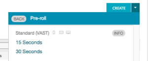

# Channel 4 Ad Setup {#channel-ad-setup}

To get started, you'll want to understand the duration of the ad as it'll determine what type of ad you create. Then you can:

* Navigate to the ads page and select a 15 or 30 second ad

* Upload a video and under the Basic section&nbsp;input the "Clock Number"

    * Clock numbers are required for this process and must be in the correct format:

        * First 3 characters are letters
        * Middle sections = 4 letters followed by 3 numbers
        * Last 3 characters are numbers

* Once you've completed the Basic section, move to the Admin tab and choose the appropriate categories across each section (Product, Sensitive, and Restricted)
* Choose to add a companion banner where relevant
* Under Pixel, you can add any relevant pixels for additional tracking

The final step of this process will require support from an Adobe Account Manager, so you can save the ad as is and reach out to your rep.
