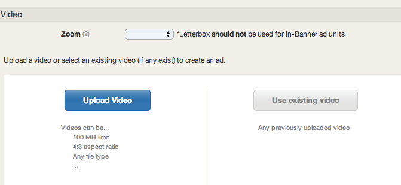

# Tablet Tap-To-Play 300x250 {#tablet-tap-to-play-x}

## Create a New Ad

* Click on Ads in the left navigation
* Select New Ad in the top right corner
* Choose Phone Tap-to-Play Banner> 320x50
* This unit is only for 15s or 30s videos.

### Upload the Video
  

* Upload Video: Raw creative asset. See the [standard specifications for supported ad types](https://www.tubemogul.com/ad-specs/).
* Use Existing Video: Use a previously uploaded video to create a new ad.

### Configure the Ad
  

* Basic: Name your ad and add a landing page to the click URL field.
* [Teaser](/help/dsp/planning/ad-formats/ad-features-guide/teasers-endcaps.md): Upload a 320x50 banner to entice viewer to click and expand the ad to view in fullscreen
* [Overlay](/help/dsp/planning/ad-formats/ad-features-guide/teasers-endcaps.md): Upload a 320 x50 banner is shown while the ad is playing. Can be the same as teaser.
* [Sharing Buttons](../../../../dsp/execution/ad-unit-setup/sharing-buttons.md): Layer on Facebook or Twitter buttons.
* [Pixel](../../../../dsp/execution/ad-unit-setup/3rd-party-tracking-adserving/tracking-pixels.md): Add third-party tracking pixels.
* Preview the ad in either portrait or landscape view.

### Save and Submit the Ad for Review
The [ad review](../../../../dsp/execution/ad-unit-setup/ad-reviews.md) team verifies that the ad is rendering properly and clicking through. Approval time is typically 2-4 hours on regular business hours and 24hrs on weekends.
Remember that in order to deliver your campaign, you must attach your ad to a placement. 
