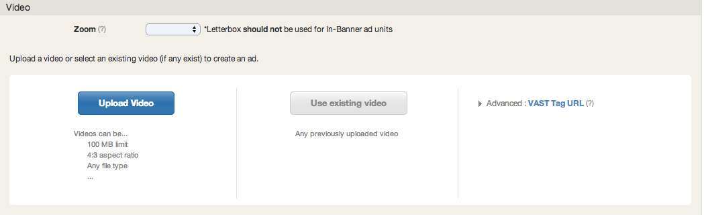

# Phone + Tablet App Pre-Roll {#phone-tablet-app-pre-roll}

## Create a New Ad

* Click on Ads in the left navigation bar
* Select New Ad in top right corner
* Choose Phone + Tablet Standard Pre-roll
* Select 15s or 30s only

### Upload the Video
  

* Upload Video: Raw creative asset. See the [standard specifications for supported ad types](https://www.tubemogul.com/ad-specs/).
* Use Existing Video: Use a previously uploaded video to create a new ad.
* Advanced: [VAST Tag URL](../../../../dsp/execution/ad-unit-setup/3rd-party-tracking-adserving/ad-tags.md) To avoid reporting discrepancies, consult with your Account Manager to verify your mobile ad server has been certified.

### Configure the Ad
  

* Basic: Name your ad and add a landing page to the click URL field.
* [Pixel](../../../../dsp/execution/ad-unit-setup/3rd-party-tracking-adserving/tracking-pixels.md): Add third-party tracking pixels.

### Save & Submit for Review
  
The [ad review](../../../../dsp/execution/ad-unit-setup/ad-reviews.md) team verifies that the ad is rendering properly and clicking through. Approval time is typically 2-4 hours on regular business hours and 24hrs on weekends.
  
Remember to attach the ad to the correct placement.
