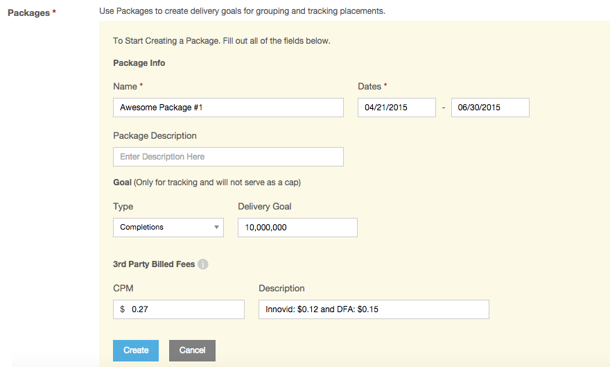

# Campaign Setup {#campaign-setup}

To create a new campaign, navigate to the left hand menu and select Campaigns. Once on this page, you will see a blue "Create New Campaign" button on the right hand side.

* Name: Choose a name for your campaign.
* Advertiser: Select an advertiser (brand) or create a new one.
* Advertiser URL: brand’s official page . This field speeds up your ad approval process on our inventory partner’s end.
* Timezone: Select the timezone for reporting and bidding.
* Customer PO: This field is optional, but can be used if your IO has a customer purchase order.
* Frequency Cap: Allows you to frequency cap at the campaign level. (also optional)

The next section is Campaign Goals. Fill out the Campaign Spend Cap and decide if you'd like to enter a frequency cap for your campaign.

The last sction is Packages. Packages are groups of placements based a common goal for easier management, tracking, and reporting.  

 
## Feature Set Up:

Click **Create a New Package** and specify the package settings.

 

* Name: Choose a name for your package
* Dates: Flight dates, note that all placements tied to this package must fall within these dates. These dates must also fall within the campaign flight dates.
* Description: Optional, if you'd like an additional description
* Goal Type: Select the metric that is your primary goal
* Delivery Goal: The number you'd like to deliver
* Package Type: The pricing method you'd like to track against. The platform will only track this metric, not cap delivery.
* 3rd Party Billed Fees: Enter a consolidated CPM amount and 3rd party fee description. **Note:** This feature doesn't override fees for optional services, such as Nielsen, comScore, and IAS, are tracked as "non-billable other cost." To bring your own rate for these services, contact your Account Manager.

<!-- Where do you do this? It's not in this UI, I don't think -->Once you create a package, be sure to associate the appropriate placements with the package.

The 3rd Party Verification section includes settings for:

* [IAS Viewability](../../dsp/measurement/viewability/ias-integration.md)
* [Nielsen DAR](../../dsp/measurement/nielsen-ocr-reporting.md)
* [Comscore VCE](../../dsp/measurement/comscore-vce.md)

 
Once your campaign is created, click on the blue widget next to your campaign name to enable Campaign [Optimization Goals](../../dsp/optimization/optimization-goals.md). This feature allows users to set optimization goals and priorities in order of importance and automatically adjusts spend to sites where you are delivering the metrics you most care about, ensuring that your dollars are spent efficiently to achieve your goals.

>[!NOTE]
>
>* Campaign Optimization Goals will apply to all placements created **after** campaign goals are set. They will not apply to any placements created **before** campaign goals are set.
>* Any Optimization Goals set for a particular placement within the [Placement Editor](placement-setup.md) will override goals set at the campaign for that placement.
