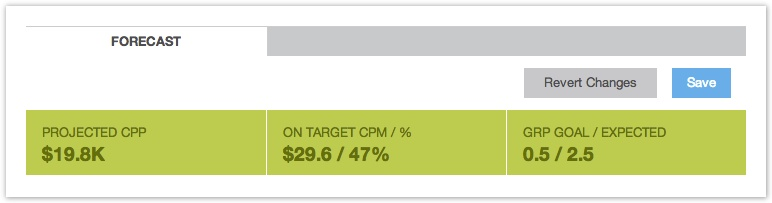

# GRP Setup {#grp-setup}

1. Click on New Placement
1. Select your Ad Format
1. Select BrandPoint View/ GRP mode   

   

1. In the top right corner, click on Edit OptionsName your placement  (Recommended Naming Convention: Test Campaign: GRP: PR15s: US )

    * Status: Choose whether the placement should begin right away or stay paused until you've confirmed all details.
    * Tags: Optional key words to help you search for your placement within the TubeMogul UI.
    * Pacing: Determine if you'd like to spend your daily placement budget evenly across 24 hours or as fast as possible within a couple of hours of the day. Fill as Fast as Possible accelerates delivery and is effective for placements with tight targeting parameters or short flight dates.
    * [Optimization Goals:](../../../dsp/optimization/optimization-goals.md) Sites demonstrating strength in this metric will be favored during bidding
    * [Conversions](conversions.md): TubeMogul enables you to easily track conversions through our platform. It's recommended to  [create a conversion pixel](conversions.md) at least a week prior to campaign launch to ensure proper implementation and pixel firing. Once implemented, this is where you can enable the pixel on the placement level. Conversions can be any action performed by a viewer who was exposed to an ad such as returning to the brand site, signing up for a newsletter, inquiring for more information, etc.

1. Next, follow the steps below:

    * GOALS:

        * Set target audience based on gender, Nielsen designated age groups and GRPs. Keep in mind that the starting age range is exclusive of the year; the ending range is inclusive of the year. The Cost per Point will dramatically change as you narrow the population that you are targeting and often will decrease.
        * GRP- Pick the number of GRPs you would like the placement to deliver
        * Frequency Cap- select the number of types you want to reach a unique viewer. This will be the cap for the duration of the placement.

    * THIRD PARTY REPORTING: Select either [Nielsen DAR](../../../dsp/measurement/nielsen-ocr-reporting.md) or [ComScore vCE](../../../dsp/measurement/comscore-vce.md) reporting.
    
    * BUDGET: Choose flight dates, options for [dayparting](../../../dsp/planning/targeting/targeting-options.md), budget and [inventory tier](../../../dsp/planning/brand-safety/sitesafe-quality.md).
    
    * LOCATION:
        * Americas: United States, Canada
        * Europe: United Kingdom, France, Spain, Germany, Italy, Ireland, Sweden, Norway, Finland, Romania, Denmark, Netherlands, Switzerland, Belgium
        * APAC: Australia, Japan, Indonesia, Taiwan, Thailand, Malaysia, Hong Kong, Singapore, Philippines, Vietnam, China, South Korea
        * In-product Nielsen OCR reporting is only supported in the US, UK, Canada, France, Brazil, Australia, Germany and Italy. DMA targeting within the United States is available for the top 30 DMAs. DMA targeting is currently unavailable in all other countries.

    * PUBLIC INVENTORY: Although we typically recommend running across T1-T3 sites given this is an audience buy, if you'd like to target a specific contextual site list, we recommend you filter by % on-target  or CPP.

   * [PRIVATE INVENTORY](../../../dsp/planning/private-inventory.md)
   * [OTHER FILTERS](../../../dsp/planning/targeting/targeting-options.md)
   * ESTIMATED RESULTS: Forecast tools are determined by the GRP Goal, Frequency Cap, Budget and any additional targeting parameters set within the placement.
        * Projected CPP is the estimated cost of purchasing one GRP for your target demographic, this CPP is guaranteed by TubeMogul within 20%.
        * GRP Goal is determined by the GRP Goal set in the left navigation, date range and the time period set for your budget. If you have set your GRP Goal for 30 per ‘All time’ for 1 month and x budget per day, the GRP Goal in the Forecast Menu will show you a Goal of 1 GRP a day.
        * On Target CPM is the CPM for every on-target impression (CPM/on target percentage).
        * On Target % is the percentage of impressions that were delivered to your target demographic (on target impressions/total impressions).

  
