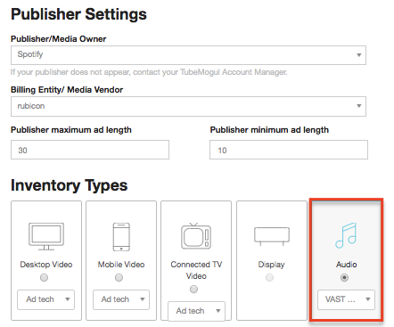
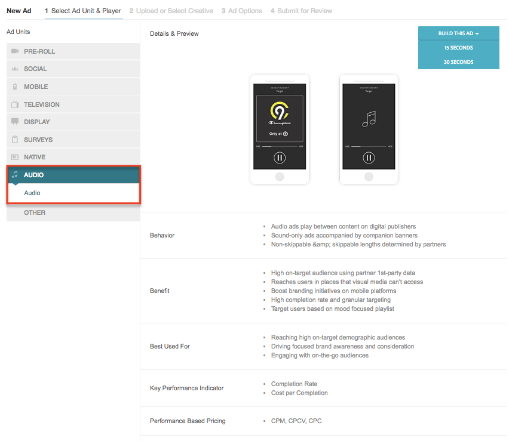
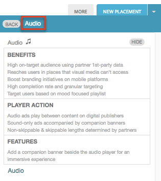

# Audio {#audio}

## STEP 1 - Feed Set-up

* Users have the ability to create Audio feeds directly from the Deal Set-up page.

## STEP 2 - Audio Ad Set-Up

* Create an Audio ad in the ad section of the UI. The ad will be length agnostic during initial set up.
* Upload one of the three compatible file formats (.AAC, .OGG, .MP3) and the transcoder will create a tag with all files.

<!-- assets from wiki page won't appear. I copied above image into assets folder for this and the 2 other wiki links on this page.

-->

* You won’t have the option to copy ads or campaigns and have the audio ad retain its transcoding. For Phase 1, it is recommended to create new ads.

## STEP 3 - Attaching Ads to Placements

* Create an "Audio" ad in platform ad and select an “Audio” feed to attach to the placement in the placement editor UI
* Audio ads will only deliver when attached to a placement that has an “Audio” feed attached to it.

* You must create third-party ads independently, not part of the placement creation workflow
* Copy ad and copy campaign feature will not carry over transcoding properties
* Assets are all transcoded to 196 bit rate
* Bulk edit add blacklist/whitelist will not work for GA phase 1
