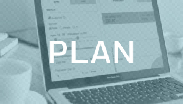

# User Guide {#dsp/}

## User Guide Topics {#dsp/-topics}

<table>
 <tr> 
  <td> 

  
Use our planning tools to build proposals, choose ad formats and targeting parameters and project inventory avails.
  </td> 
    
  <td>  

  
Learn how to set up your campaign, placement and ads within the platform.
  </td> 
 </tr>
 <tr> 
  <td>  

  
Leverage our real time optimization capabilities and generate the greatest impact for your video ad campaign.
  </td> 
    
  <td>  

  
Understand how to use our platform reporting tools and schedule daily reports sent directly to your inbox.
 </td> 
 </tr>
</table>