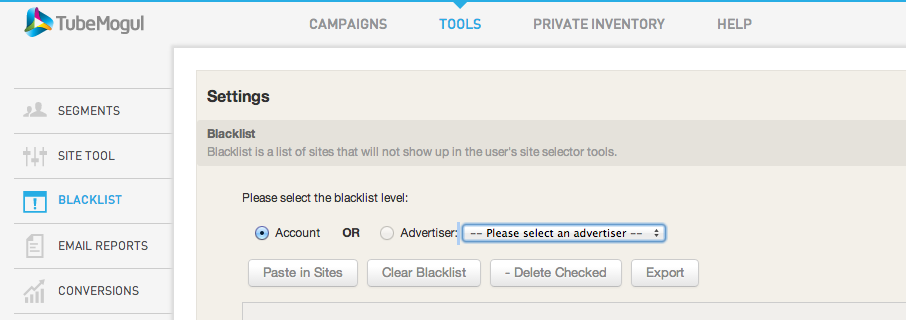

# Blacklists {#blacklists}

Apply a black list at the Account or Advertiser level to prevent your ads from running on specified sites.

* Click on Tools section on the menu bar at the top of the page
* Click on Blacklist from the navigation bar on the left
* Select whether you would like the Blacklist on the Account or Advertiser level
* Copy and paste in your black list

 