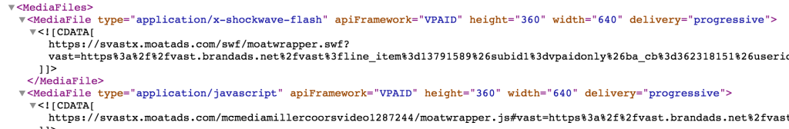

# VPAID JS {#vpaid-js}

`Starting at the end of 2016,` [ `Chrome`](http://mkto-ab110051.com/DJ4000K0PF000f03c4100U0) `and` [ `Safari`](http://mkto-ab110051.com/kJ0Lc0400f001FU0030500P) `browsers will begin blocking Flash content by default. In preparation for this change, the digital ad ecosystem has already started adopting VPAID JavaScript as an additional form of ad delivery and execution.Though current adoption is only at around 10-15%, this number will continue to grow as publishers continue to adapt to the new requirements.`
`To help minimize the chances of your ads getting blocked and to ensure that we are continuously providing you comprehensive viewability reporting, we released a few product updates on October 5, 2016:`

* `VPAID JavaScript inventory for desktop and mobile video is now available through TubeMogul’s platform`
* `TubeMogul expands its proprietary viewability measurement solution to include mobile video running on VPAID JavaScript inventory using the MRC standard`
* `IAS and MOAT viewability reporting now encompasses mobile video, if running on VPAID JavaScript`

Note: VPAID Flash support will not be deprecated immediately to support a smooth transition.

`In addition, our display offering is already 100% HTML/JavaScript enabled.`

**Advised Actions**

`To ensure that you are maximizing scale and are delivering across both VPAID Flash and JavaScript inventory where available, here are our advised actions.`

1st-Party / TubeMogul Ads``

All videos uploaded as interactive pre-roll will automatically be converted to VPAID Flash and JavaScript in TubeMogul’s platform. For overlays, it is recommended that an image is uploaded (e.g. JPEG, PNG, GIF). If a SWF/Flash file is uploaded, the ad will not be served into VPAID JavaScript  inventory.

3rd-Party Ads``

`Upload a single tag that references both VPAID Flash and JavaScript media files for maximum scale. Or, create two ads and upload a tag that references VPAID Flash and JavaScript media files separately (i.e. two tags) -- TubeMogul’s platform will automatically deliver the acceptable asset based on the inventory type.`

`Here’s an example of the VPAID Flash and JS media file:   
`

**Additional Best Practices:**

* `For overlays, only use image or JavaScript 3rd-party pixels, avoid using SWF/Flash-based files within the VPAID tag`
* `For` [ `VPAID JavaScript`](http://mkto-ab110051.com/Q0fP00F0J81c0043U00O000) `and VAST creatives, use MP4 videos instead of FLV to ensure scale`

**How to Run Video Ads on VPAID JavaScript Inventory Through TubeMogul’s platform: **

`Placement Set-up`

`Select a :15s or :30s Interactive Pre-roll Placement - the placement will automatically deliver on desktop and mobile video VPAID Flash and JavaScript inventory, where available.`

 
`Note: If you would like to only target desktop or mobile video inventory in the platform, go to`Device Type targeting in the Placement Editor and select either Computer or Smartphone and Tablet.
 

Viewability Reporting``

**`Under the Viewability Tab of the placement, TubeMogul metrics on the site level will include both desktop and mobile numbers. IAS and MOAT downloadable reports will also include desktop and mobile metrics, but reporting is currently blended since vendors are not separating out reporting by screen.`**

 

**` `**

**`If you have any additional questions please reach out to your Account Manager or platform_demo@tubemogul.com`**

 
  