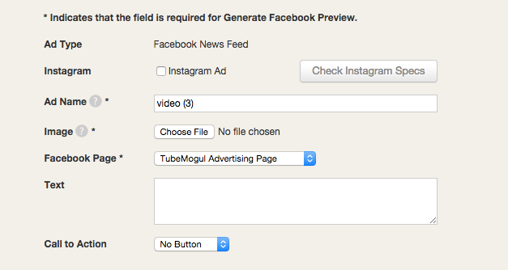

# Facebook Ad Setup {#facebook-ad-setup}

The platform allows you to upload a video or use an existing post. If you'd like to upload a video, review the [Facebook ad specs](https://www.tubemogul.com/ad-specs/social-specs/) before creating your ad.

>[!NOTE]
>
>* Caption length can be up to 90 characters
>* Thumbnail image is required and should match the aspect ratio of your video
>* Maximum length: 45 minutes (suggested max length 3 min)

After you have the appropriate specs or if you'd like to use an existing post, navigate to the ad section from the left hand menu. Click "Create" and choose Facebook News Feed from the Social section.

Once you've selected the ad type, you'll be able to Upload Video, Use existing video, or Use existing post.

To use an existing post, you'll need to enter the "Page Post ID" or search for the post within the account under the Basic section of the ad configurator.

After that you can move to the Pixel section, if you have any pixels you'd like to attach to the ad. Move to the bottom of the page if you'd like a full list of the pixels that are accepted from Facebook.

Fill out all the applicable pixel information, skipping the Pixel Provider and Save & Close. Note, the ad configurator only supports Impression pixels.

 
The other option when building your ad is to select Upload Video or Use existing video. Choosing either of these options, will take you to the Basic section of the ad configurator and require that you fill out the following information:

* Ad Name
* Image - upload a thumbnail to act as a teaser for the ad
* Facebook Page - tie it to the appropriate page
* Text - enter up to 90 characters
* Call to Action - choose the action you'd like to have on your ad

    * After selecting a CTA, you'll need to enter a:

        * Click URL - this must go to the landing page and can be a 3rd party click tracker
        * Display URL - the text that you'd like to be displayed that is hyperlinked to your landing page

>[!NOTE]
>
>All these fields must be filled out in order to generate a preview of your ad.

Note that Fb determines the video quality  in preview as well as at runtime according to different parameters like detected bandwidth, device, location etc. Users can switch to HD in the preview (and in realtime) to improve video quality.

From there add any pixels you'd like to include in the ad and Save & Close. Once this ad is attached to the Facebook placement you're all set.

Full list of pixels that are accepted:

* Comscore
* Nielsen
* Visual IQ
* Ipsos
* Milward Brown
* Adometry
* Aggeragate knwolegde
* Atlas
* Convertr
* Da consortium
* Datalicious
* Doubelclick
* Facilitate Digital
* Flashtalking
* GFK Nuragu
* MArkit
* Mediaplex
* MIG/xaxis
* Neodata
* Next Audience
* nicequest
* Research now
* Smart Adserver
* Symphony Advanced Media
* Weborama
