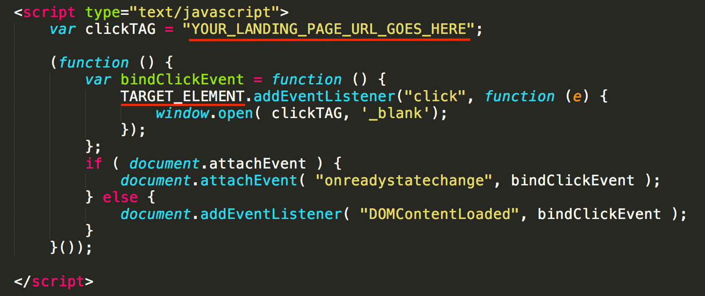

# In-Display Setup {#in-display-setup}

TubeMogul supports HTML5 creatives for standard display and companion ads. We still support Flash creatives, but highly advise users to consider building display ads in HTML5 to remain in sync with the market's shift away from Flash.

## Set Up Below

* Click on Ads
* Select Display
* Choose from [Click-to-Play](../../../user-guide/planning/ad-formats/in-display/click-to-play.md), [Rollover-to-Play](../../../user-guide/planning/ad-formats/in-display/rollover-to-play.md), [Branded Autoplay](../../../user-guide/planning/ad-formats/in-display/branded-autoplay.md) or [Expandable Click-to-Play](../../../user-guide/planning/ad-formats/in-display/click-to-expand.md).

## For Standard Display
  

* Choose between TubeMogul Served or 3rd Party (Sizmek or DFA)
* Creative Type: Image, Flash, HTML5&#42;
* Upload assets
* Add Click URL

>[!NOTE]
>
>When using HTML5 users need to upload them using a HTML5 Zip Container (zip file containing the HTML file and associated assets). Full list of steps below:

Insert the code snippet below inside the `<head>`element of the HTML file.

In the snippet:

>[!NOTE]
>
>The HTML file MUST have a clickTAG variable in order to be accepted by the platform. The platform supports ONLY two spellings for the clickTAG variable: “**clickTAG”** or “**clickTag”**(any other spelling will result in the ad being rejected).

* Replace the text `YOUR_LANDING_PAGE_URL_GOES_HERE` with the URL where you want your audience to land after clicking the ad.
* Replace `TARGET_ELEMENT` with the DOM element in the ad upon which the click event should be attached (example: `document.`getElementById(‘ad_container’))`.

For an example of how the above code snippet should look like in a working HTML file, click [here](assets/index.txt).

* Place your HTML5 file and associated assets into a folder and generate a Compressed (Zip) File. This is the HTML5 Zip Container.

* When building your display ad and companion banner in the platform, select the HTML5 option and upload your Container.
* Once uploaded, the destination URL appears in the "Click URL" section. Any update to the "Click URL" overrides the URL hardcoded in the original HTML file.

Caveat: Fallback images are not supported when using TubeMogul to serve HTML5 display creatives. To implement fallback images, you need to build them directly into your HTML5 creative according to the [HTML5 browser support matrix](https://caniuse.com/).

## For Video

* Upload Video: Raw creative asset. See  [Ad Specs.](../../../user-guide/planning/ad-formats/ad-specs.md)
* Use Existing Video: Use a previously uploaded video to create a new ad.
* Advanced: 3rd Party Ad Tag. We currently accept DFA and Sizmek SSL compliant tags.

## Configure the Ad
  

* Basic: Name your ad and add a landing page to the click URL field.
* [Teasers](/help/user-guide/planning/ad-formats/ad-features-guide/teasers-endcaps.md): Include an image or a 7-10 second video to entice viewer to user-initiated the video play. Recommended to have strong call to action, recognizable images and brand logo.

* [Overlays](overlay.md): Add a 300x60 banner to enhance message/brand association and drive additional clicks. For Expandable CTP, leverage the "Background" overlay Layer.

* [Endcaps](https://education.tubemogul.com/user-guide/execution/ad-unit-setup/teasers-endcaps/): Upload an image at the end of the ad to encourage traffic to the site.

* Sharing Buttons: Add Twitter or Facebook buttons to drive social sharing.
* [Pixel](3rd-party-tracking-adserving/tracking-pixels.md): Add in 3rd party tracking pixels or TubeMogul's retargeting pixel.

## Save & Submit for Review
  
TubeMogul's [ad review](ad-reviews.md) team verifies that the ad is rendering properly and clicking through. Approval time is typically 2-4 hours on regular business hours and 24hrs on weekends. 
