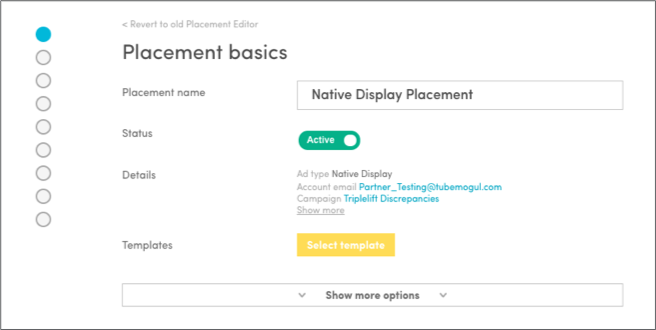

# Native Ads Setup {#native-ads-setup}

Below are step-by-step instructions on how to set up native ads.

## 1. Create Native Placement

Navigate to the Placement Editor and click **Create > Native > [Ad Type]**.

Enter information in the placement, such as name, status, flight dates, location and more.

Both Native Video and Display placements will automatically target both desktop and mobile (Web and App). The placement will only deliver based on the ad type attached (i.e. it won’t deliver autoplay videos unless an autoplay ad is attached). Targeting both devices will yield the most scale.

If you want to target only desktop or only mobile in a single placement, apply device type targeting.

>[!NOTE]
>
>* By targeting both mobile and desktop in a single placement, placement level reporting will be blended. To report by screen, target only desktop or mobile.
* To maximize delivery across all Native SSPs for mobile web, app and desktop - we recommend setting up your ad accordingly to meet min/max requirements of all inventory sources.

## 2. Create Native Ads

Navigate to the Ad Type Selector and select Native Display or Video.

>[!NOTE]
>
> Here is where you choose your ad type whether its Autoplay, Click-to-Play, or Display. Adobe will determine where to run your native campaign based on the type of native ad you attach to your native placement. Cinemagraphs are a Display ad type and can be optimized by targeting a unique feed (contact your account manager for help to set that up).*

### Native Display Ads

Create your native display ad in the Ad Configurator tool. Here are the assets required for creating an ad:

Native creative or image asset requirements:
* Recommended Minimum: 1200 x 627px
* Absolute Minimum Size: 600x600px
* File Type: JPEG or PNG File
* File Size: Less than 1MB.
>[!NOTE]
>
>The image can't include text.

Text copy requirements:
* Title: Recommended max 25 characters, absolute max 140 characters. Should stand on own.
* Description: Recommended max 100 characters, absolute max 200 characters.
* CTA (Optional): Max 15 characters
* Sponsored by (Advertiser name): 25 Characters

Logo requirements (optional, but recommended for more prominent branding)
* Format: JPEG / transparent PNG
* Recommended Minimum: 300x300px
* Absolute Minimum Size: 80x80px
* Ratio: 1x1

URL requirements:
* Landing page URL

### Native Video Ads

Native Video ads should follow the same specs as Display in terms of logo, headline, description, etc. You'll also need to ad a display asset as a cover image before the video renders on the viewer's page. Please follow all the above specs for those details. For the video asset specific specs, see below:

Start by creating a video ad, either uploading a video asset or use previously uploaded videos. Pre-roll and other video assets can be used for native video ads.

All video assets are hosted by Advertising Cloud DSP.

  
Recommended Format:
    * 16:9 ratio
    * MP4, 720p video quality

Recommended video length:
    * 60 seconds (TripleLift)
    * 60 seconds, 120 seconds max (MoPub & ShareThrough)

Recommended video size:
    * 30MB max (TripleLift)
    * 30MB max (Sharethrough)
    * 2MB, 5MB max (MoPub)

>[!NOTE]
>
>TripleLift Click-to-Play desktop is a good format for long-form content. However, please use the recommended video specs to ensure smooth scaling across all inventory.

## 3. Access Reporting

Once placement and ad set-up is complete, native ads will start running. Reporting is available at the campaign, package, placement and ad level. Initial metrics include:

* Impressions
* Clicks
* CTR
* Views – video start
* Completion rate: 25%, 50%, 75%, 100%

### 3rd-Party Viewability Reporting

Advertsing Cloud DSP is integrated with 3rd-party vendors IAS and MOAT to enable you to measure viewability on native campaigns directly in the platform. 3rd-party viewabiltiy reporting is activated at the campaign level. Note that if activated, all applicable placements under that campaign will have access to IAS or MOAT viewability reports.

Once activated, both IAS and MOAT reports are downloadable in the campaign and placement level.

>[!NOTE]
>
>3rd-party viewability tracking is only available for ShareThrough and TripleLift ads and is not available on MoPub inventory. See the [list of certified native tracking pixels](3rd-party-tracking-adserving/certified-native-tracking-pixels.md).

## 4. Impression and Click Tracking Pixels

### Impression Tracking

TripleLift, ShareThrough and MoPub accepts 3rd-party impression tracking pixels. Trackers need to be a 1x1 image URL format. Place tracker in the Pixel tab of the ad.

### Click Tracking

#### ClickThroughs

TripleLift, ShareThrough and MoPub accepts 3rd-party click tracking pixels if the tracker has a landing page URL embedded in the tracker. If this is the case, place the click tracker URL in the Landing Page field of the Ad Configurator. NOTE: this tracks for clicks from headlines, CTAs, and the card itself that drives  clickthroughs

##### Video Expansions

Not currently supported
