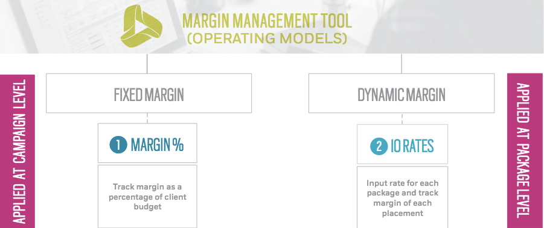

# Margin Management Tool {#margin-management-tool}

Simplify your workflow by leveraging TubeMogul’s campaign financials tracking/management and placement grouping tools. Use the following features and eliminate the need for external campaign workbooks while seamlessly automating many of your more manual processes.

A. Margin Management

Manage and accurately track campaign financial margins directly in the platform by applying a margin to be deducted from either the campaign or package level.

 
The above highlights the 2 operating models that can be used with this tool. Click here to read more about [Fixed Margin](fixedmargin.md) and here to learn more about [Dynamic Margin.](dynamicmargin.md) 