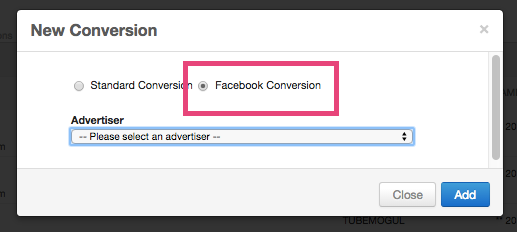

# Facebook Conversion Pixel Setup {#facebook-conversion-pixel-setup}

**STEP 1: **Create a New Conversion pixel by clicking on the Tools option in the top menu bar. Then click on the Conversions tab on the left hand navigation.
**STEP 2:**Select Facebook Conversion and choose the appropriate advertiser. For the pixel to work, you MUST select an advertiser that is already setup to work with Facebook.

 
**Step 3:**  Choose the campaign and either import a pixel that you've already created in the Facebook platform or create a new pixel.

* Note, Facebook only accepts 1 pixel per account. If the account already has a pixel, then "Create a new pixel" will be greyed out.

 
**Step 4:**Once you've completed naming the pixel, it'll prompt you with the HTML tag that you can use to track your conversions.

 

While Facebook only allows for 1 pixel per account, users can modify the pixel to track multiple events. If you click on "Learn about conversion tracking", it'll prompt you when all the possible actions and event code that you'll have to implement.

 
If you have any additional questions, reach out to your Account Manager or platform_support@tubemogul.com. 