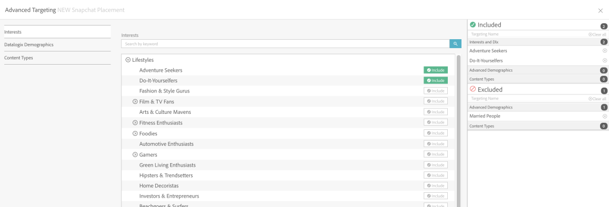

# Snapchat Placement Setup {#snapchat-placement-setup}

## CREATING A PLACEMENT

* There are two ways to enter the Placement Editor. New Placement Selector **or** Quick Select Dropdown


## BASIC PLACEMENT CREATION

* Name the placement, input basic flight info and goals


* Packages: You can only associate Snap Ads with restricted-packages (no pacing management). 
  
* Budget: the minimum daily budget is $100 USD + the tech fee.
  
* Goal Metrics: You can optimize for impressions, swipes, video views or app installs. Note, that once your placement goes live you will not be able to modify this. 

  >[!NOTE]
  >
  >Note the following caveats as well:
  >* Only one goal is allowed per placement
  >* Default optimization is Impressions
  >* Once the placement is saved, the optimization goal cannot be changed
  >* Only Long Form and Web View ad types can be attached to Snapchat placements set with the Swipes optimization goal
  
* Max Bid: You can set your max bid based on CPM or Cost per Swipe. However, please note that all billing is based on CPM.
  
* Forecasting: Once a geo has been selected, the forecast widget on the right hand side will begin to populate with Snapchat's predictions.
    
## Recommendations
  
Snapchat advises users to plan on creating a placement‘paused’ first while awaiting approval of creative assets as Snapchat has stringent creative policies in order to prevent any delay in delivery during the actual designed flight period.
  


## Targeting


1. **SNAPCHAT SPECIFIC** 
   

    1. **Placement Type:** Snapchat allows you to select between Snap Ads only, or Content.

        1. ***Snap Ads:*** run between Stories and Discovery content ``
        
        1. ***Content:*** runs only in Discovery, Publisher Stories, Shows, or Our Stories ``

    1. **Regulated Content Only**

        1. Certain Snap Ads need to be regulated for their content (alcohol, 13+ or R-rated, movie trailers, etc) as to not expose them to underage users, thus these ads will not be shareable.  If a Snap Ad placement has the "Regulated Content Only" denotation, shareable ads will not be allowed to be attached to the placement. ``
        1. If running ads for alcohol, gambling or R & 13+ rated movies, you are required to turn on the Regulated Content flag. ``

            1. *NOTE*: these ads are NOT shareable and thus the "shareable" checkbox should not be marked within the Ad Configurator. `              
            
               `

    1. **Advanced Targeting     
    
       **

        1. This is where you can leverage Snapchat's unique Lifestyle Category targeting as well as 3rd party data from partners that Snapchat has integrated with.

            1. *Lifestyle Categories*: Snapchat's unique targeting segments based on their user's interests / content consumption in the Snapchat Discover Feed.
            1. *Datalogix Demographic*: DLX Shopper, DLX Comscore (Viewer), DLX PlaceIQ (Visitors) targeting segments.
            1. *Content Categories:* Allows advertisers to specify publisher content types for better brand messaging efficiency. Categories include: News, Entertainment, Technology and more.

1. **LOCATION / GEO TARGETING [ ](assets/geo.png)**

    1. Only one country is targetable per Snapchat placement ``
    1. Certain countries allow for States, Regions to be targeted ``
    1. You cannot update your selected region once the placement goes live ``
    1. DMA and postal code targeting is only available in the US. ``

1. **AUDIENCE TARGETING**

    1. SNAPCHAT AUDIENCE MATCH (1 `ST` PARTY DATA) `  [ ](assets/create-segments-1.png)`

        1. Snapchat allows you to upload your 1 `st` party data for targeting, this is called Snapchat Audience Match (SAM). SAMs can either be created as custom audiences from a .csv file you have uploaded, or audiences created from programmatic video, display or native ads previously run on the Ad Cloud.  ``
        
        1. The above shows how to create the Snapchat audience directly in the Audience Segments module. You can also create audience segment using the Segment Manager, shown below. [ ](assets/segment-manager-1.png) [ ](assets/segment-manager-2.png)
        
        1. **Note**: you will need to upload either a CSV or TXT format of raw (unhashed) mobile IDs or email addresses. If uploading hashed files, the files will also need to be in SHA256 format. ``
        
        1. You can also choose to create look-alike audiences based off the created segments. These look-alike audiences are consumers who share similar characteristics with an the advertiser's existing customers.

            1. Once you have SAMs, you will be able to create a look-alike audience off that audience pool ``
            1. Look-alike audiences are not readily available for all countries and regions [ ](assets/lookalikes.png)

    1. ` *CREATING A SAM FROM **OLV, DISPLAY OR NATIVE* ```

        1. From existing pre-roll video, mobile display and other mobile ads, simply check the box within the audience tab of that particular ad's configurator. This will create a mobile audience (SAM) that can be retargeted in Snapchat. `  [ ](assets/programmatic-retargeting-2.png) [](assets/programmatic-retargeting.png)`

`` 