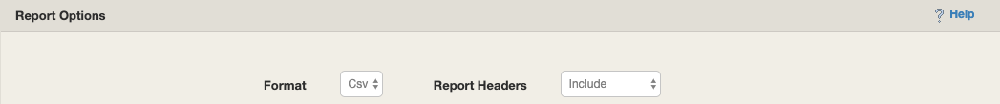
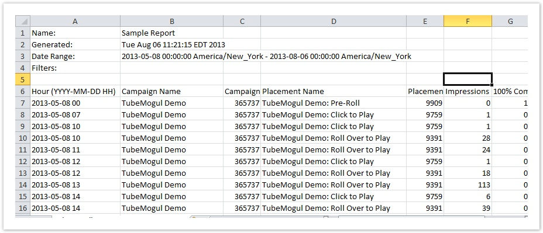

# Email Reports {#email-reports}

The Email Reports tool allows you to customize the content and delivery of your report data. You can either:

* Completely configure campaign performance reports at a granular level.
* Choose from pre-configured data report templates, including the Billing Report, Conversion Report, Device Report, Frequency by Impression Report, Frequency by App/Site Report, Geo Report,Margin Report, Media Performance Report, Segment Report, and Site Report.

<!-- Add when available in MD -->
<!-- See [definitions of all metrics available](glossary-of-reporting-metrics-and-dimensions/). -->

You can generate reports once, or schedule them to be generated daily, weekly, or monthly at 03:00 in the specified time zone. Once a report is generated, a notification is sent to each specified email recipient, with a link from which to download the file.

## Where to find it
  
Click on the Tools section in the navigation bar:

From there, click on the Email Reports button on the far left side of the page:

## Create a Report

There are several options available for detailing what should be included in your report and how it should be applied.

### Filters
  
Filters define the scope for your report.   There are two kinds of filters in email reports.

* **1) Filter by Date:** Define the timeframe for your report. You can setdates to `reporton` past events or set it up to send data for future campaigns.

The options for this filter are:

* **Timezone**: Select from a list of timezones, depending on what’s appropriate for your campaign.  This could be the same timezonethat you’ve set for the account (the default) or a differen tone, but remember to check the timezone when comparing reported metrics from the UI with what you’ve set for your email reports.

* **Previous __ days:** The default is 2 days. You can enter any number of days up 985 days (3 years) and receive full day reports leading up to today.  For example, if you created a one-time report on August 1st and selected “previous 2 days”, you would receive a report for July 31st and August 1st.

  Note thatreports with length > 90 days can only be delivered as a single frequency report.

* **Custom:** Selecting this option enables you to create a report for any date range starting on or after January 1, 2013 to any time in the future.  Select this option if you want to set up regular reports going to some future date, or if you have a very specific range not covered by the other two options.

  Note that reports with length > 90 days can only be delivered as a single frequency report.

* **Last Calendar Month:** Selecting this option will return a report for the last calendar month through today’s date. For example, if I were to create a one-time report using this option on January 23rd, I would get a report for January 1st through the 23rd.

* **2) Additional Filters:** The second type of filter is for parameters that will focus on specific data in your account. For example, if you only want to see data only on a certain advertiser, limit your report to pre-roll ads, or review activity for selected countries, you would set these values in the filters. You can filter by: Advertiser, Campaign, Placement, Ad, Ad Type, Video, Video Duration, and Country and Package.

Up to six filters can be applied to a single report.

When you create your filter, you can also specify criteria within that filter by specifying if the value you want is equal or not equal to a value. For example, if you want to see only ad types that are not pre-roll or results that are only for one campaign. Once you have entered one criterion, you can use an “and” or an “or” command to link it to other criteria. For example, if you wanted data in your report for the US and Canada, your filter would look like this:

)

But if you want to see only data for all countries outside the US or Canada, you would set it up this way:

Be careful when using the “and” command with “equals” in particular when creating reports. Putting these two together can actually exclude all of the data, if you set it to equal and not equal one variable. For example, this filter would exclude all of the data:

This is telling the database to get all of the records where the country is Australia but are also not Australia.

Putting this all together, if you wanted to create a report for May 1st – July 31st 2019 that will only show data for advertiser “Example’s” videoads in the United States and Canada, your filters would look like this:

## Build your report

In this section, you’ll be selecting the “meat” of your report and how it will be arranged and sliced.

There are two groups of items you can select here:

* **Dimensions**: These are categories of data and tasks that we organize campaigns around, like advertiser, ad type, placement, etc. It also includes the time frames you want to look at (eg. hour, day, week, month, etc.) and geographic area. These will define the rows in your report.

* **Metrics**: These are the actual measurements of the campaign that help you determine if you hit your goals, like impressions, click-throughs, completions, etc. These will define the columns in your report.

* **Conversion Metrics**: Advertising Cloud conversion metrics captured using multi-touch Advertising Cloud conversion metrics will be available if you have configured multi-touch conversion tracking. This will include Adobe Analytics conversions as well conversions captured using the Advertising Cloud Conversion pixel, depending on which kinds of tracking you have configured. You will see a list of advertisers and beneath each advertiser, you will see the Conversion Metrics available for that `particularadvertiser`. To learn more about conversion optimization tactics, go [here](../../../new/performance-display-playbook.md).
  
  Note that these metrics will be displayed based on the multi-touch attribution rules you specify in the Report Options section.

* **Custom Goals**: These are `combinations for Conversion Metrics used as goals forAdvertisingClouds optimization engine.This option will be available if you have configured multi-touch conversion tracking.LikeConversionMetrics you can see the Custom Goal availablelisted beneath each advertiser. To learn more about how to setup Custom Goals, go [here](../../../new/performance-display-playbook/building-a-custom-goal.md).

  Note that these metrics will be displayed based multi-touch attribution rules you specify in the Report Options section.

To add a Dimension or Metric to your report:

1. In the box on the left, expand the relevant group and make a selection from the options.
1. In the box on the right, select the check box next to your selection.
1. In the summary below, your selection will appear.

The screenshot below shows the process for specifying you want hourly data in your report:

Continue doing this until you have selected all of the dimensions and metrics you want to include. Note that you can drag your selections in the box at the bottom to reorder your headers in the report.

This example shows what the screen would look like for a report that will show you hourly reporting, by campaign and country on impressions and 100% video completion.

## Report Options

### Multi-Touch Conversions Options

#### Format and Report Headers

These settings determine the format in which you’d like your report to be delivered, whether CSV or tab format, include the header or remove headers, which means the name of the report and the filters applied to it, like the date range.

After you’ve set your format and headers, you canchoose options related to multi-touch attribution. Multi-touch attribution allows you to view ConversionMetrics and Custom Goals in many different ways. For example, if your Conversion Metric is “Orders” you can choose to see “Orders” based on a specified attribution rule and view-through weight.

Note that these options are only applicable to advertisers with multi-touch attribution enabled. To verify, check your [advertiser settings](https://www.tubemogul.com/adcloud/settings/profile/advertiser-list?&action=ADVERTISER_LIST_SEARCH) To have your advertiser be setup for multi-touch attribution, please contact your account manager.

#### Attribution Rule Settings

You can choose one or more attribution rules. Based on the rule chosen, the values for your Conversion Metrics and Custom Goals will change. For example, with first event attribution, Ad A may get credit for a conversion. With Last event attribution, Ad B may get credit. You can include multiple attribution rules for side-by-side comparison. For more information about attribution rules, see the [appendix on attribution rule calculations](assets/attribution-advertising-cloud.pdf).

##### Paths as Columns

This allows you to see Conversion Metrics and Custom Goals broken out based on whether they were preceded by a click or an impression. Or you can just see the total without any breakout.

Additionally, when viewing the Total you can choose a view-through weight to apply. Learn more about view-through weights [here](assets/attribution-advertising-cloud.pdf).

**Terminology**

1. **Total (TL) = CT + VT * VT weight:** Total conversions including view-through conversions and click-through conversions. View-based conversions will be adjusted according to the view-through weight specified. View-through weight a value between 0% and 100%. The view-through weight will default to the value you have specified for attribution settings. In the report this will be indicated with a “(TL)” after the conversion name.  

1. **With Clicks (CT)**: Click-based conversions. These are any conversions preceded by at least one click. This is a raw value and is not adjusted according to the view-through weight. In the report this will be indicated with a “(CT)” after the conversion name.

1. **Impression Only (VT)**:  View-based conversions. The are conversions preceded by only impressions. In the report this will be indicated with a “(VT)” after the conversion name.

##### Cross-Device Reporting

This allows you to see Conversion Metrics and Custom Goals based on whether the conversion was same-device or cross-device. Cross-device conversions will only be measured if an Advertiser has been configured to usea device graph. A conversion is defined as cross-device if more than one device was involved in the path to conversion.

**Terminology**

1. **Same-Device (sd)**: Conversions where only one device was present in the conversion path. In the report, next to your conversion metric name and rule type, you will see (SD). 

1. **X-Device (sd)**: Conversions where more than one device was present in the conversion path. In the report, next to your conversion metric name and rule type, you will see (XD). 

1. **Totalconversionsincludingcross device- if applicable**:  Total conversions including both same device and cross device (if applicable). In the report, next to your conversion metric name and rule type, you will see (tp).

Note: cross-device options are only applicable to advertisers with cross-device enabled. If you do not have a device graph enabled for a specific advertiser, then your (xd) column will not contain any values and your (sd) and (tp) values will be the same. Cross device attribution reporting is free of charge and one attribution graph can be mapped to a single advertiser.

* To verify if your advertiser has cross device enabled, check your [advertiser settings](https://www.tubemogul.com/adcloud/settings/profile/advertiser-list?&action=ADVERTISER_LIST_SEARCH) [page](https://www.tubemogul.com/adcloud/settings/profile/advertiser-list?&action=ADVERTISER_LIST_SEARCH) under General > Integrations > “Cross-device attribution”. To have your advertiser be setup for cross-device, please contact your account manager.

##### Conversion Reporting Based On

This affects the datesee Conversion Metrics and Custom Goals are associated with. “Conversion Timestamp” will show values based on the day the conversion event happened. “Event Timestamp” will show values based on the day the impression or click happened.
 
#### Combinations

The report will automatically include all combinations of the attribution options you have chosen.The column label will include values indicating which options apply to that metric.

For example, if you choose the following options, you will see two different columns for each of your Conversion Metrics. If you had chosen “orders” as a conversions metric your report would include these columns.

#### Add Email Recipients
  
In this section, you can specify who you’d like to receive the report, and how frequently. Reports can be sentmultiple email addresses and each recipient can be set to have their report delivered at aspecific interval:a one-time, daily, weekly or monthly basis.

*Reminder*: in order to deliver a report > 90 days, only reports with a delivery frequency of “once” allow for it.

When you’re ready to schedule or send the report, click on **Create Custom Report.** By creating your report,you are also saving it and thus can always return and edit your report settingslater.

Scheduled reports  will be delivered to the addresses you specify at about 9 am the next morning according to the  `timezone` specified in the request as a link to a page where they can download the file.  They will look like this:

## Edit and delete your reports

Go to the “Email Reports” page, and click on the options link.

