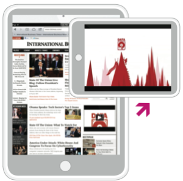

# Tablet Tap-to-Play Medium Rectangle (300x250) {#tablet-tap-to-play-medium-rectangle-x}

## 

**Player Action:**

* 300x250 user-initiated banner is served within mobile browsers
* On click, video expands to full screen within a device’s native video-player

**Benefits:**

* User-initiated unit delivers engaged viewers who choose to watch your video
* Inventory available at scale across customizable site list
* Video can be any length (<2min recommended)

**Considerations:**

* Should be a smaller part of the overall campaign

**Recommended Pricing Model:**

* [CPM](../../../../user-guide/planning/ad-formats/performance-pricing.md)

**Video Specifications:**

* View asset specs [here](../../../../user-guide/planning/ad-formats/ad-specs.md)

&nbsp; 