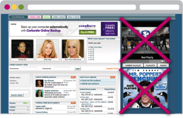

# PlaySafe (Fake Pre-roll) {#playsafe-fake-pre-roll}

PlaySafe prevents pre-roll video ads from auto-playing within display banners on low quality sites. This is a widespread practice that defrauds advertisers who think they are buying regular pre-roll advertising, but are instead getting an ad unit with much less value.

 

Our technology detects ad unit and video player sizes and other attributes to determine whether the unit is regular or autoplay pre-roll. The default is set to exclude this type of inventory unless otherwise specified by your team during the site list planning process.
 