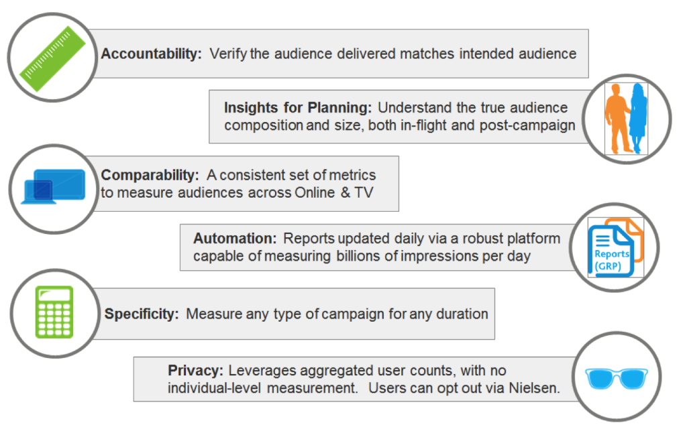

# Audience Verification {#audience-verification}

**Benefits&nbsp;**

**Nielsen OCR Methodology**
How does Nielsen work for TV?

* 25,000 Nielsen boxes in homes monitoring what is watched by whom
* Nielsen takes this 25,000 unit sample and models it out to represent the viewing habits of all U.S. households

How does Nielsen OCR work for digital?

1. Advertisers tag their ad with a Nielsen code snippet
1. Facebook records when logged in users view tagged ads on Facebook.com or other sites
1. Nielsen tracks where an ad is being seen and how often
1. Facebook’s anonymized, aggregate audience demographic data is combined with Nielsen’s impression data
1. Advertisers receive reports within days about the performance of their ad campaign

[Click here](../../../user-guide/measurement/nielsen-ocr-reporting.md)to learn more about Nielsen OCR Reporting within the TubeMogul platform.
&#42; ComScore VCE reporting &nbsp;is not available in platform but can also be tracked. Please contact your Account Manager for details. 