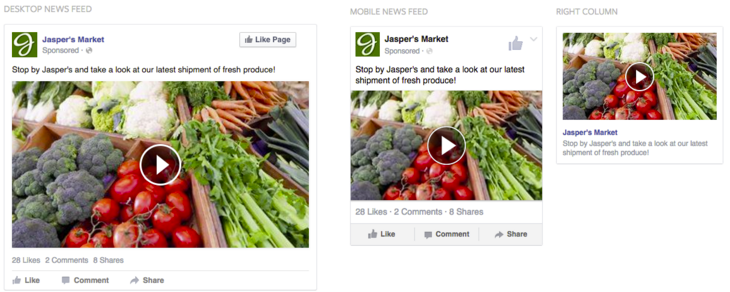

# Facebook Partnership {#facebook-partnership}

TubeMogul is the first platform of it's kind to launch an API integration with Facebook to enable advertisers to execute Facebook and Instagram advertising campaigns in the same fashion as within Facebook's platform.  Our integration provides advertisers a simplified, efficient and effortless way to plan, buy, manage and measure all their initiatives from a single platform. This partnership has several benefits including:

* Holistic channel management and simplified workflow
* Global scale and reach of the 1.6 billion monthly active users
* Granular targeting utilizing Facebook 1st party data
* Cost efficiency
* Increased engagement and recall
* Full-screen takeover - specific to Instagram
* Extended reach across both platforms
* Retargeting across different channels, from traditional desktop into these social platforms
* High on-target audience rates verified by Nielsen

`Facebook Video`

This new ad unit loads in users' News Feeds as a "Sponsored" post on desktop of mobile devices - or in the right-hand rail of desktop browsers; the promoted post displays in the midst of posts from the user's social network.

`Instagram Video`

Also, included in the offering this ad unit appears in people's Instagram feed alongside photos and videos shared by a user's friends. The ad blends into the user experience, with only a "sponsored" label to distinguish them.

 
`Targeting Capabilities`

* The same granular audience targeting as available within Facebook's platform utilizing first party and 3rd party data from companies like Axiom, Datalogix, etc.

* Retarget your desktop video or display audiences on Facebook/Instagram to allow for sequential messaging or suppression targeting for extended reach

`Things to Keep in Mind`

* FBX inventory - we run on Facebook's News Feed inventory whereas FBX only has desktop display inventory that does NOT utilize Facebook's data or targeting
* Facebook doesn't currently support 3rd party tracking outside of Nielsen DAR and comScore VCE. This includes viewability reporting as well. - update to include the rest of the 3rd party
* Retargeting is only available into Facebook but not from Facebook to other channels

If you have any additional questions, please reach out to your Account Manager or platform_support@tubemogul.com. 