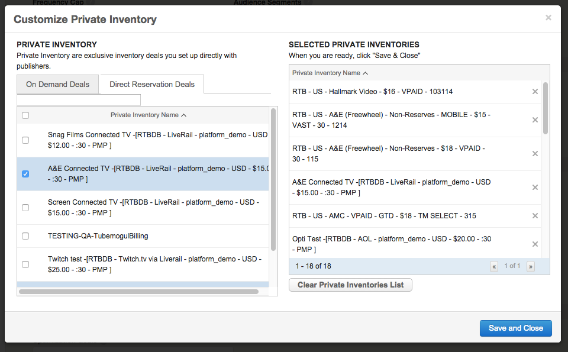

# Pre- Negotiated Deals aka Smart Ad Serving {#pre-negotiated-deals-aka-smart-ad-serving}

This feature enables advertisers with existing private deals to activate their inventory for centralized planning, buying, and measurement on the Adverting Cloud DSP.

## Feature Set Up

To begin, click on the “Private Inventory” tab at the top of the page. From there, navigate to the left hand menu and choose the "Analytics" option. On this page you will be able to "Create New Feed" and choose "Smart Ad Serving".

Once you've moved into the feed creation process, the workflow is as follows:

### STEP 1: Name the feed and decide on the billing structure**

1. Choose a Feed Name: Enter a name for your feed or auto generate a name. Example of an auto generated name: RTBDB – Publisher Name&- Advertiser- USD – $20.00 – :30 – PMP
1. Select the Billing option you would prefer.

    * If you'd like to have the publisher bill sent directly to Adobe contact your Account Manager
    * If you'd prefer to receive the bill, the Adobe fees will be available in the rate card

1. Choose the advertisers within the account that will access this inventory

]

### STEP 2: Are you using Deal ID?

1. Deal ID:

    * Identifier key that references a specific agreement to buy media inventory between a publisher and a buyer
    * Enable faster activation and tag testing process
    * **Deal ID for video is available on Google AdX, SpotX, Liverail, and Teads**
    * **Deal ID for display is currently only available for Google AdX**

1. If you are not using a DealID select "No" and move onto the "Inventory Types" section. This will create the appropriate feed based on ad type.

### STEP 3: Fill out the Publisher Settings and Economics

1. Publisher Settings:

    * Search for your Publisher
    * Enter the Billing Entity/Media Vendor: Add the vendor that will be sending the bill.
    * Publisher Max Ad Length: Select the maximum duration of the ads accepted by this publisher, either 15 seconds or 30 seconds.

1. Choose the relevant Inventory Types
1. Economics

    * Fill Type: In this field, you can specify if your deal is a guaranteed buy or not.

        * Guaranteed buys are deals where you and the publisher have agreed on a pre-defined quantity of inventory, targeting, and timeframe – in other words, you are not bidding on impressions if they fit your criteria in an auction, you’ve agreed to buy any and all impressions that come through the feed.
        * Non Guaranteed buys are deals where there is no set impression delivery commitment between you and the publisher.

    * Contracted CPM: Here you will enter the CPM you’ve contracted for this feed. If your deal is not for guaranteed inventory (see above) you will be able to select from a fixed or floor CPM. Fixed CPM means that the price of the inventory is at a negotiated fixed rate. Floor CPM means the minimum you have to pay for the inventory is at this rate; however, depending on market conditions, the CPM may fluctuate and increase.

        * CPMs are always in the same currency as the account (or in USD).

Image

1. Flighting (optional)

    * You can use this section to track your private deal’s pacing and delivery. If delivery is under or over pacing, please consult with your publisher directly to adjust how much volume they are sending through the feed. 

### STEP 4B: Selecting A Default Ad- Applicable for Guaranteed Feeds Only

A default ad is important for guaranteed feeds because it ensures that no impressions are wasted. We recommend you do this, and/or target more placements to the guaranteed feed, at your earliest convenience.When you select an ad in this section, we create a default placement in the campaign associated with the ad. The name of the placement we automatically create will be Default Placement – Guaranteed Feed – <ad name> – Account ID. 

We recommend that you keep the “Default Placement – Guaranteed Feed” somewhere in the name to distinguish it from your other placements, but you can also edit the placement and change this name. You can edit this placement and change the date range or attach more ads; however, none of the other targeting options such as geo, site list, day parts, budget etc will be available or applicable-if you have issues with volume or targeting, contact the publisher directly.

Note: If you are running an Interactive Pre-roll adtargeting aparticular feed, please confirm with the publisher that they support VPAID enabled tags before targeting. If they are not VPAID enabled, the ad will not deliver on this publisher site.

### STEP 5: Emailing the Tag

In order to actually run your ad, whether you’ve made a guaranteed feed or not, you will need to send the tag to the publisher for testing and verification.   The system will prompt you to do this with an automatically generated email that includes all of the important details. You have two options:

* Use the “Copy & Finish” button to copy the text to the clipboard; the message can then be easily pasted into an email message. If you take this option, you must also cc  [publisher_support@tubemogul.com](mailto:publisher_support@tubemogul.com) and your Account Manager to ensure our internal teams are available to assist the publisher if needed; OR
* Use the “Email & Finish” button to create a message in your email client. With this option, the TubeMogul aliases will be automatically cc’d’ you just need to input the email of your publisher contact.

Publishers will receive a tag pickup page via the link you send to them.

After they declare the Ad Server and confirm the feed details the tag will be generated.

Once everything is confirm, the page will ask the publisher to double check the tag to ensure that all the appropriate macros are included to ensure that they work with their ad server.

### STEP 6: Placement Setup

`` 

If you're utilizing this tool for a video line item, once you've completed the steps above, a placement will automatically be created. If you are setting this up for display, you will have to create a placement and specifically target the feed you've created.

In the placement editor, click the Private Inventory box and select "Customize Private Inventory".

Under the Direct Reservation Deals tab, choose the applicable feed(s):

*&#42;Note, if you select the box next to "Private Inventory Name" all available feeds will be selected.*

Now you're all set!

**Tips and Best Practices**

* Whether your feed is guaranteed or non-guaranteed, target it with ads as soon as possible to maximize your delivery and ensure the publisher has something to test.
* When billing through TubeMogul, please email [publisher_support@tubemogul.com](mailto:publisher_support@tubemogul.com) with the information below. TubeMogul will use this to generate an IO for the publisher to sign:

    * Flight Dates
    * Impressions Goal
    * Billing Contact

* [Manage your feeds](brandaccess/feed-management.md)
* [Check feeds reporting](https://education.tubemogul.com/user-guide/planning/private-inventory/brandaccess/feeds-reporting/) and publisher reporting regularly to avoid huge discrepancies

### Have a Publisher that only accepts Event Pixels?

* This is also available in the platform! Please reach out to your Account Manager to get you set up.

If you have any questions or are having trouble creating a feed, please contact your Account Manager and include the feed name and tag to expedite the troubleshooting process.
