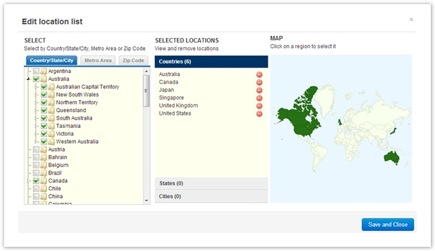
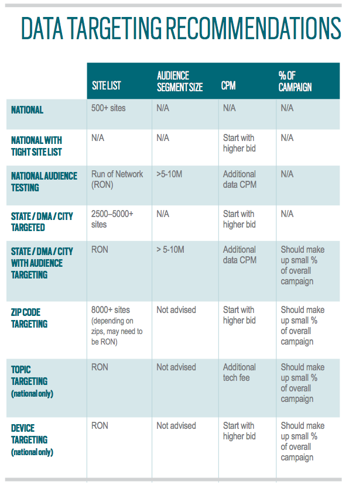

# Targeting {#targeting}

Harness the platform's advanced targeting and automated optimization to achieve the most persuasive power per dollar of any solution in the video advertising industry. We give advertisers control over both contextual and behavioral audience targeting.   
**Put Your Brand in Context**
  
Select the exact sites and apps where you want your ads to run.&nbsp;We give you unprecedented control over where your&nbsp;video ads run. You can choose from thousands of sites&nbsp;and social games that align with your target audience.&nbsp;Sort by comScore Top 250 or Top 500 sites, sites by&nbsp;vertical category or pick sites individually. Whatever&nbsp;you choose, you can be confident your ads will only run&nbsp;in environments worthy of your brand. Learn more&nbsp; [here](targeting/contextual.md).

**Target Your Audience Using Any Data**
The platform integrates all types of audience data so you can benefit from impression-by-impression targeting.

1. Your own data – use data gathered from your own properties to retarget a specific audience segment. You can create custom cookie pools of site visitors or viewers who have seen a previous ad. Learn more&nbsp; [here.](targeting/retargeting.md)
1. 3rd-party data – target specific audience segments using data from vendors such as BlueKai, Exelate, Lotame, etc.&nbsp;Learn how to access our list of 3rd party audience segments [here.](targeting/behavioral.md)

**Zero in On a Specific Location**
  
Control where your ads run and target specific countries, states, DMAs and zip codes.&nbsp;Select the locations where this placement will run.
   
** [More Targeting Options](targeting/targeting-options.md)   
**
  
Day Parting: Select what time of the day to run your ad. &nbsp;A recent study shows that online video's primetime is between 8pm and midnight. Learn more in the Research section of our site.

Device Targeting: Choose a specific device, browser, or IOS/Android targeting for Mobile campaigns.
Use our easy-to-use site tool to search and filter through thousands of sites to find the most contextually relevant inventory for your placement.

&nbsp;

When choosing pre-roll you now have access to cross-screen device targeting. The placement will target pre-roll in desktop as well as mobile. If you'd like to separate the inventory all you have to do is de-select the 'Include Mobile Apps' box.

**Targeting Best Practices**

&nbsp; 