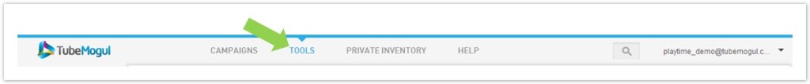
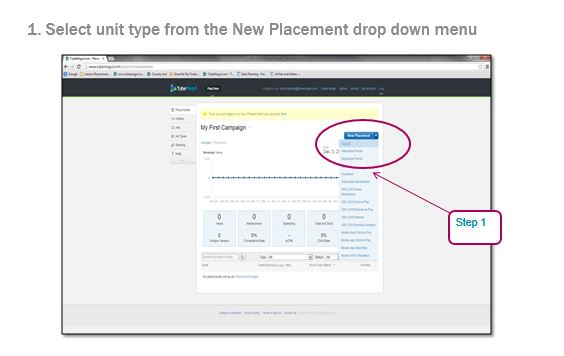
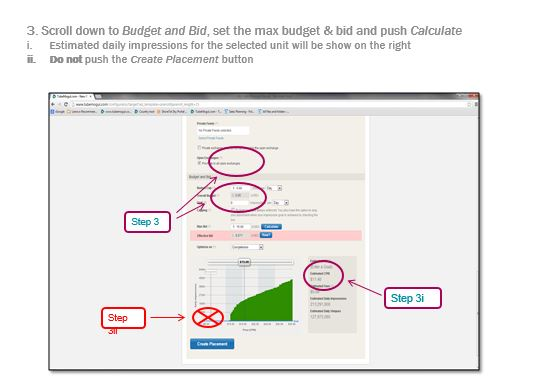

# Contextual {#contextual}

To create a contextual site list, log-in to your TubeMogul account, click on Tool section of the menu bar at the top of the page.

Then click on the Site Tool option on the left side navigation bar. This pulls open our Master Site Tool shown below:

1. Select an Ad Unit: Choose the type of ad unit you are interested in using.

   

1. Select Geographic Locations 

1. Select Devices (optional): Only applicable to Mobile units. 
1. Topic Targeting (optional): Type in topics you are interested in contextually targeting. Topic Targeting allows you to target pages with content that is relevant to your audience. This type of targeting should only be applied to a small percentage of your overall buy and to nation wide campaigns.  Activation of this feature will incur an additional fee.
1. Brand Safety (optional): This feature is part of our comprehensive  [BrandSafety Suite](../../../user-guide/planning/brand-safety.md). Use  [PageSafe](../../../user-guide/planning/brand-safety/pagesafe-proximic.md)to filter out pages with undesired content. Activation of this feature will incur an additional fee.

**Relevant filters while planning your site list: **

* Search: Search for sites by URL or keywords
* All Categories: Selects sites based on categories or subcategories
* TubeMogul Recommended: Curated site lists compiled based on gender and age
* Qualitative:

    * Comscore Top 100 Publishers
    * Site Quality by  [Tier](../../../user-guide/planning/brand-safety/sitesafe-quality.md)

* Quantitative: Daily impressions volume
* Other: Check Exclude  [Autoplay](../../../user-guide/planning/brand-safety/playsafe-fake-pre-roll.md) Pre-roll if you want to avoid running on fake pre-roll.
* Demographics: Data pulled from the comScore API which accounts for around 30% of our inventory. When using this filter, it is recommended to complement with TubeMogul Recommended site lists.
* Paste List: Copy/paste pre-selected sites to confirm inventory availability
* Save As: Create a site list and save for future use
* Clear Site List: Start over
* Export: Export the selected site list for internal or client review

Select your search results by checking the box next to the site's url. To select all sites found, click on the box next to the title "Site Name". 