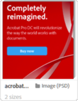
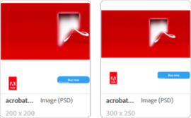

# About your Creative Library

The Creative Library allows you to manage all of the creatives you'll use in your ad experiences. Your Creative Library includes all of the creatives you've added, and you can view your creatives as cards or as a list.

## Creative Types

You can add and manage the following creative types in the supported creative sizes:

### Image

*Creatives in GIF, JPEG, JPG, or PNG format* - You can upload images from your Adobe Creative Cloud and Adobe Experience Manager accounts or from a local file. Note: Each ad experience requires a default image creative, which is used when a browser isn't JavaScript-enabled or when the ad server can't personalize the ad because of delays.

### Photoshop Image

*Creatives in Photoshop Document (PSD) format* - You can upload images from a local file, and you can optionally generate different sizes of the original file, generating a creative group. You can then assign a creative group to an experience either individually or all at one time. Photoshop creatives can't be used as the default image for an experience.

The card view, by default, includes a card for each Photoshop creative group; you can click any creative group to see the individual creative sizes in the group. You can optionally flatten the card view to include separate cards for the size variations. The list view is always flattened.

#### Example default card views for a Photoshop creative with size variations and the child size variations

A creative group, showing the parent creative and the number of size variations



*On drill down* Child size variations for the creative group



### Flexible HTML5

Flexible HTML5 — *HTML5 creatives with all of their images and other attributes as standard HTML tags, which you can edit directly within Advertising Cloud Creative, either within the Creative Library or within an individual experience (which creates a variation of the original creative)* - You can upload HTML5 creatives as ZIP files or use one of the provided templates as a starting point. See the specifications for flexible HTML5 creatives.

The card view, by default, includes a card for each base flexible creative you uploaded, with an indicator of how many variations of the creative exist. You can optionally flatten the card view to include separate cards for each base creative and each derivation. The list view is always flattened.

#### Example default card view for a flexible creative with variations

### HTML5

*Simple or static HTML5 creatives with attributes as they are specified in the creative files* - You can upload HTML5 creatives as ZIP files. If you want to edit any attributes or add images, you need to upload a new ZIP file to add a new creative.  See the specifications for simple and static HTML5 creatives.

### Third-Party

*JavaScript tracking tags for creatives hosted on third-party ad servers* - The script will vary by ad server; the following is an example:

```javascript
<SCRIPT language='JavaScript1.1' SRC="https://ad.doubleclick.net/ddm/adj/A123456.12345GDN.COM/B1234567.123456789;sz=300x250;ord=[timestamp];dc_lat=;dc_rdid=;tag_for_child_directed_treatment=?"> </SCRIPT> <NOSCRIPT> <A HREF="https://ad.doubleclick.net/ddm/jump/A123456.12345GDN.COM/B1234567.123456789;sz=300x250;ord=[timestamp]?"> </A> </NOSCRIPT>
```

### DCO

Ad trafficking tags for your existing Adobe Media Optimizer Dynamic Creative Optimization (DCO) experiences. DCO ad tags may be in either JavaScript or iframe format. The following is an example of a DCO JavaScript ad tag using Doubleclick (DFA) as the primary ad server.

```javascript
<script type="text/javascript" src="http://www.everesttech.net/ads/mts/5958?DFA_Click_Tracker=||%c||&DFA_BuyId=%ebuy!&DFA_PlacementId=%epid!&DFA_AdId=%eaid!&DFA_CreativeId=%ecid!&DFA_SiteId=%esid!&%g"></script><noscript><iframe width="300" height="250" scrolling="no" frameborder="0" allowtransparency="true" hspace="0" vspace="0" marginwidth="0" marginheight="0" style="margin:0px;" src="http://www.everesttech.net/ads/mti/5958?DFA_Click_Tracker=||%c||&DFA_BuyId=%ebuy!&DFA_PlacementId=%epid!&DFA_AdId=%eaid!&DFA_CreativeId=%ecid!&DFA_SiteId=%esid!&%g&njs=n"></iframe></noscript>
```

## Next

Once you add creatives to your Creative Library, you can preview, edit, add or remove labels, download, delete, and regenerate thumbnails for your creatives. When a creative has child creative variations, you can view the variations within the Card view.

You can add your creatives to any of the experiences you create, optionally changing the default landing pages, tracking URLs, and any flexible attributes on an individual basis.
