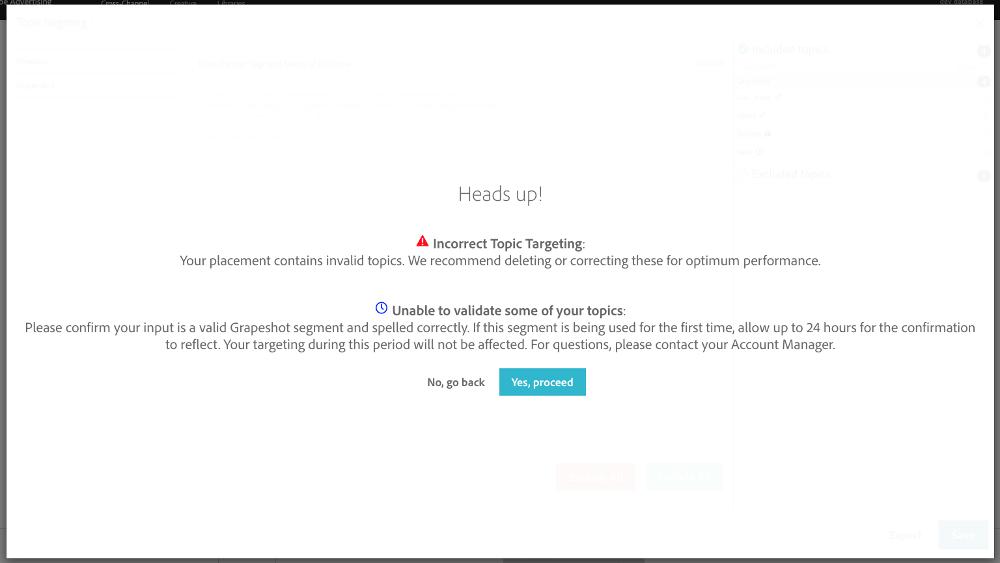

# Grapeshot Brand Safety {#grapeshot-brand-safety}

` ` ` `Grapeshot is a contextual targeting partner that enables`` ` `advertisers to set`` ` `pre-defined, custom, and`` ` `/or`` ` `socially trending keyword targeting services.``Grapeshot `` ` `C`` ` `ontextual`` ` `C`` ` `ategories`` ` `enable`` ` `advertiser to`` ` ``` ` `target, avoid, prioritize, and require specific keywords`` ` `to`` ` `appear on`` ` `a webpage before their ad can be delivered.`` ` `Whereas,`` ` ``` ` ` `Grapeshot Predicts``` ` `uses social listening technology to find trending content associated with your keyword targeting parameters. Using social feeds and popular`` ` `news`` ` `and blog`` ` `content`` ` `,`` ` `future trending keywords are added to the targeting mix`` ` `, allowing advertisers to reach their audiences on trendi`` ` `ng content across the internet.`` Grapeshot segments can be seamlessly targeted across desktop and mobile web for video and display placements within the Advertising Cloud platform.&nbsp;Include existing Grapeshot Segment IDs, or create new Segment IDs through the Grapeshot team via this alias:&nbsp; [thedatahotline@oracle.com](mailto:thedatahotline@oracle.com)&nbsp;or your Adobe Account Manager. Click [here](https://www.dropbox.com/s/pi0emxi00p4mhc5/Oracle_Contextual_Segment%20_index_120418.pdf?dl=0) for a sample list of Segment IDs. Once you have your Segment ID, you can get started on creating your placement in the Advertising Cloud platform. See below for workflow. Navigate to the "Audience Targeting" section, and click on "Topic targeting". [ ](assets/topic-targeting.png) Once on the Grapeshot modal, users can input their Grapeshot segment ID. *NOTE: this is not the **keyword**&nbsp;you are targeting, but the **segment ID** available within the Grapeshot platform. *To ensure optimal performance, *&nbsp;*the Advertising Cloud platform will validate that the segment IDs entered are found in Grapeshot's platform as well. For new segments, the validation may take up to 24 hours. [ ](assets/image-8.png) &nbsp; Users will be able to see whether or not their segment ID was confirmed and validated, invalid, or&nbsp;pending confirmation. &nbsp; [ ](assets/image-9.png) In addition, for efficient campaign set up and management, Grapeshot topic targeting is available for bulk edit across placements. 