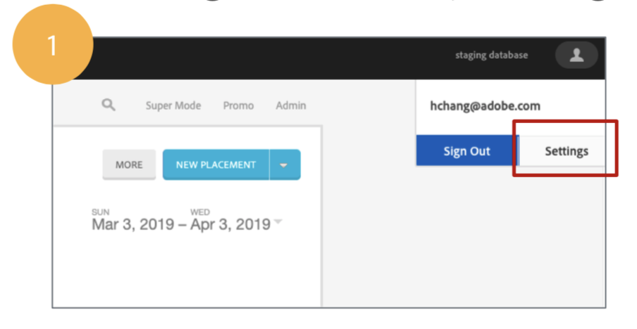
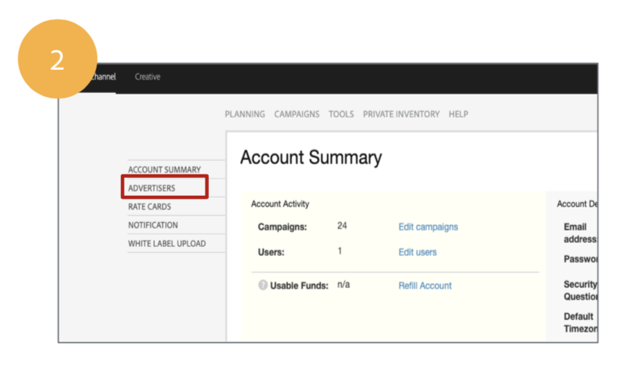
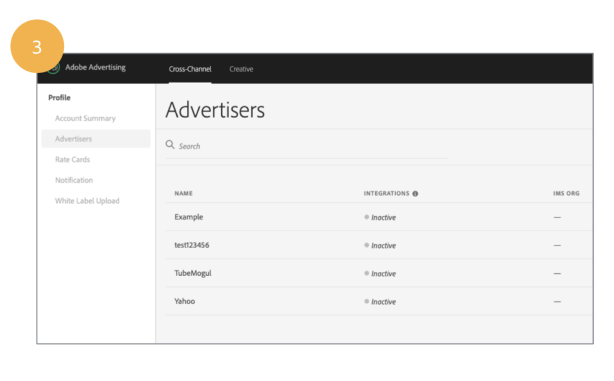
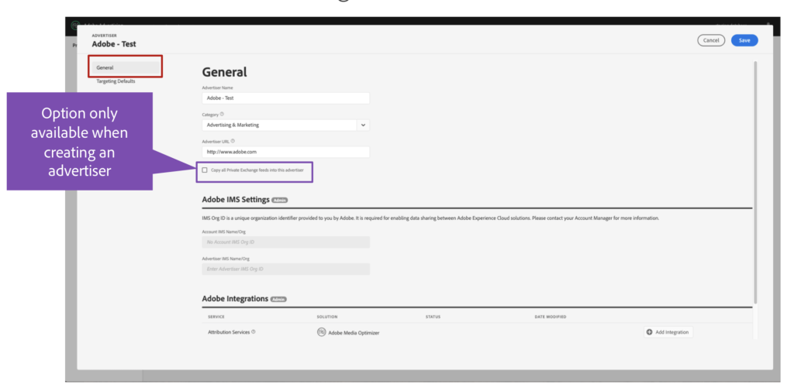

# Advertiser Management Console {#advertiser-management-console}

Use the Advertiser Management Console to&nbsp;set&nbsp;universal default settings that can be applied across all placements within an advertiser account. This not only will reduce redundancy and the time needed for campaign&nbsp;creation, it also eliminates&nbsp;potential errors that may come from manual creation. NOTE: An advertiser's default settings can be updated, but any changes will only apply to new placements going forwards, and do change existing placements.

&nbsp;

`**HOW DO I GET THERE?**`

When creating a new campaign, the option to create a new advertiser or edit an existing one will take you to the new Advertiser Management Console to set the advertiser's default settings.

&nbsp;

&nbsp;

&nbsp;

Alternatively you can navigate to the Advertiser Management Console via the following path: User Account Settings > Advertisers > Advertiser Management Console.

## How does it work

In the General Settings for the advertiser, input your basic settings and view Adobe integrations currently being accessed by the advertiser. If additional integrations are desired, please contact your account manager for further assistance.
**NOTE**:&nbsp;when creating a new advertiser, you have the option to&nbsp;share all current private exchange feeds to the advertiser. This&nbsp;is a one time action and can only be&nbsp;applied&nbsp;during&nbsp;advertiser creation.

&nbsp;

Once done with General Settings, toggle over to the Targeting Defaults section. Here you'll find the ability to set default targeting settings for geo, media quality and brand safety.

&nbsp;

Don't forget to save after you've finished. As soon as you confirm,&nbsp;the platform will add&nbsp;your settings to autofill and be applied on all future created placements as yellow highlighted selections.

&nbsp;

`**FAQ**`

***1) How&nbsp;can&nbsp;I easily update settings for existing placements if the Advertiser Management Console's default settings can only&nbsp;be applied to new placements?***

Use our bulk edit tools to quickly apply changes across multiple placements.

&nbsp;

***2) When should I create a new placement using the Advertiser Management Console's default settings vs duplicating an existing placement vs using placement templates?***

Applying templates will override any default settings from the Advertiser Management Console. Note that our targeting default settings within the Advertiser Management Console&nbsp;does not have as robust of options as templates or a completely filled out placement. In such cases where greater complexity or granularity is needed, use templates or the duplicate tool.
&nbsp; 