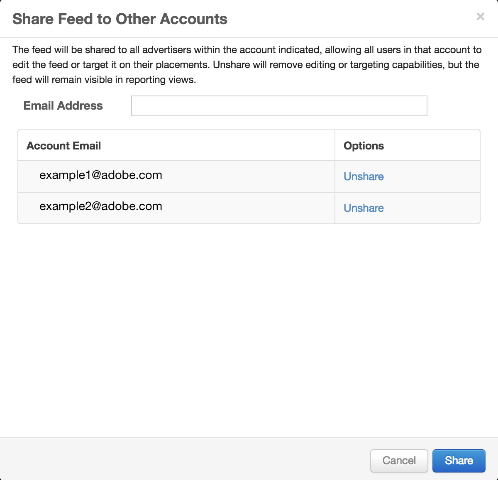

# Share Feed Across Accounts {#share-feed-across-accounts}

In order to empower brands and agencies with tools to efficiently&nbsp;manage their private inventory deals, we have added the "share" functionality. This new tool enables brands or agencies with multiple accounts to share a private inventory feed across those accounts.

To access this feature, navigate to the Private Inventory page.&nbsp;After locating the desired feed, click the gear icon on the right of the feed, and select "share".

&nbsp;

&nbsp;

Once clicking "share"&nbsp;the below pop-up will appear. Enter the email addresses you would like to share this to. Please note, all users in an account will be able to edit or target the feed once shared. However, "unshare" is always an option if you would like to stop sharing, or would like other accounts to stop using a deal.

&nbsp; 