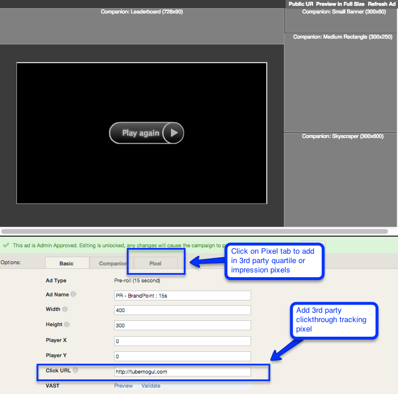

# Tracking Pixels {#tracking-pixels}

If you are using 3rd party tracking pixels, TubeMogul enables you to add these during the ad creation process and &nbsp;track a variety of integration events including impressions, clicks and completions.  **Basic Tab:**

* Click URL: Add clickthrough redirect pixel here (should be click pixels&nbsp;not&nbsp;jump tags)

**Companion Tab:** companion banner 3rd party clickthrough pixels can be added in this section. If you want to also track companion impression, you will need to create an&nbsp; [iframe](../user-guide/execution/ad-unit-setup/3rd-party-tracking-adserving/companion-banner/user-guideexecutionad-unit-setup3rd-party-tracking-adservingcompanion-banner.md). **Sharing Buttons/Overlays Tab**: &nbsp; impression and clickthroughs can be tracked for these ad features via 3rd party pixels for Mobile, In-display, Social, Interactive Pre-roll units. **Pixel Tab**: 

* Integration Events shown in the drop down will change by type of ad unit you've selected:

    * For In-Stream units, fire the pixel on the impression or quartile completion.
    * For In-Display units, fire the pixel on the impression, view, quartile completions and clicks.
    * Our BrandSights surveys can fire the following 3rd party pixels:

        * Survey Start: The first question has been answered. (Only fired if there is more than one question.)
        * Survey Complete: The last (or only) question has been answered.

* Pixel URL: drop the 1x1 3rd party pixel here
* Pixel Name: name the pixel. Recommended to be specific to avoid confusion
* Pixel Provider: Selecting the right provider is important as one of our inventory providers- Google AdX uses this as an identifier and without the proper selection may reject the ad and affect your delivery.

    * Select Nielsen if you are adding a Nielsen pixel.
    * Select ComScore if you are adding a ComScore pixel.
    * Select None for all other 3rd party ad servers.

* Once you are finished, Save & Close. Repeat the steps if you have multiple pixels to attach.

 &#42;Recommended to use a a web debugging tool like Charles or Fiddler to verify pixel fires prior to campaign launch

**Best Practices**

* Always double check if your 3rd party pixels are a click redirect or 1x1 image pixel. To verify, drop the pixel on a browser. If it redirects, it's a click tracker; if it shows an empty blank browser, it's a 1x1 image pixel that can track any integration event.
* Download a web-debugging tool like [Fiddler](http://www.telerik.com/fiddler)&nbsp;or&nbsp; [Charles](http://www.charlesproxy.com/)&nbsp;to help pixel check and verify that proper pixels are firing.

* Compare 3rd party tracking report with TubeMogul UI within 1 or 2 days of campaign launch and check for discrepancies.&nbsp;If there are discrepancies >10%:

    * Follow the below instructions to doublecheck pixel implementation:

        * Run web-debugging tool (Fiddler or Charles)
        * Go to the TubeMogul&nbsp;UI–>&nbsp;Ads–>&nbsp;Options–> Edit
        * While the ad is playing on the preview page, the web-debugging tool will record all pixels that are firing.
        * Verify the pixels fired with your 3rd party pixel map.

* If you're using a swf file then you'll need to include the tracking pixels within the file
* Verify your campaign pixel set-up with our Pixel Q&A tool located in the Tools section on the top navigation bar

