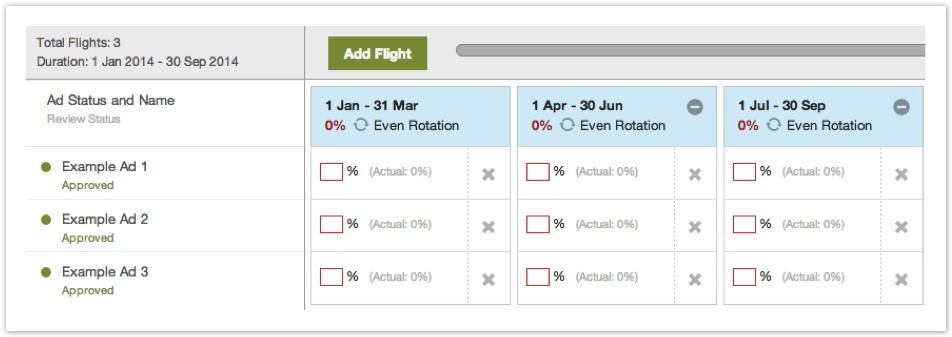
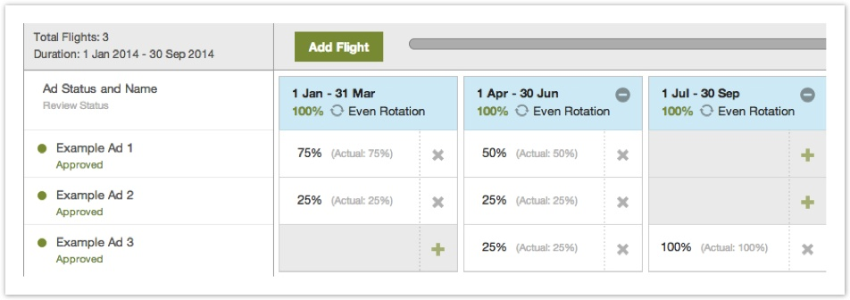
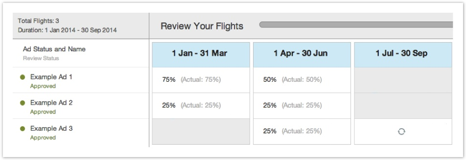

# Ad Scheduling & Weighting {#ad-scheduling-weighting}

This tool simplifies the campaign management process by allowing multiple ad swaps and different ad flights within the same placement. Here's a quick how-to&nbsp; [video](http://tubemogul.wistia.com/medias/egxhpph6ae)&nbsp;that works you through the step by step process below.
  
Once you've created a campaign placement and attached the ads, click on the placement ad drop-down to access the feature.

&nbsp;

Click on the Custom Ad Scheduling link to get to the page. By default, there should be one flight with the placement start date and end date. All attached ads for that placement should be evenly rotated in the default flight.
   
**How to Customize Flighting**
  
To set up multiple flights, click on 'Add Flight'.

Choose the appropriate dates for the first flight and assign dates for any additional flights. The tool automatically selects all the approved ads to each flight, so to remove an ad from a flight click on the&nbsp; 

X.

Conversely, to add an ad to a flight, click on the &nbsp;+ 

&nbsp;icon.

Click 'Continue' and move onto the Review &nbsp;page.

Finish by clicking 'Save & Finish'.   
**Assigning a Non-Even Ad Rotation**
  
To assign a specific rotation to each ad, click on the &nbsp; icon.&nbsp;Blue&nbsp;means that the ads are being evenly rotated,&nbsp;Grey&nbsp;means that the even rotation is off.

Uncheck 'Even Rotation' icon to enter target weights.

Enter target weights and remove ads from flights that they shouldn't be associated with.

Click 'Continue' and move onto the Review &nbsp;page.

'Save & Finish' to return to the UI.   
**Glossary and Icon Guide**
  
&nbsp;

If you have any additional questions, please reach out to&nbsp; [platform_support@tubemogul.com](mailto:platform_support@tubemogul.com). 