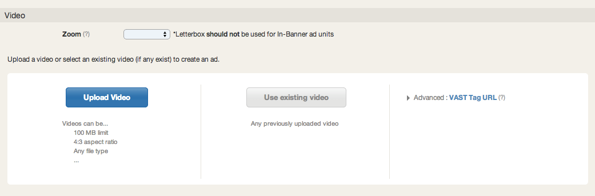

# In-Stream Setup {#in-stream-setup}

## `<iframe class="wistia_embed" src="//fast.wistia.net/embed/iframe/n3zkgzcd72" name="wistia_embed" width="640" height="388" frameborder="0" scrolling="no" allowfullscreen></iframe>` {#in-streamunitset-up-in-streamunitset-up}

**Create a New Ad**

* Click on Ads
* Select New Ad&nbsp;and choose&nbsp;the type of Pre-roll unit and duration you'd like to run. Keep in mind that the the duration of the ad will affect inventory&nbsp;availability.

**Upload the Video**

* Upload Video: Raw creative asset. See&nbsp; [Ad Specs.](../user-guide/planning/ad-formats/ad-specs/user-guideplanningad-formatsad-specs.md)
* Use Existing Video: Use a previously uploaded video to create a new ad.
* Advanced: VAST Tag URL. Use a [3rd Party Ad Tag](../user-guide/execution/ad-unit-setup/3rd-party-tracking-adserving/ad-tags/user-guideexecutionad-unit-setup3rd-party-tracking-adservingad-tags.md) to serve your ad.

    * The ad server must be&nbsp; [TubeMogul Certified](http://www.tubemogul.com/company/partners/ad-serving-and-rich-media/)prior to campaign launch.&nbsp;If your ad server is not named, please contact&nbsp; [platform_support@tubemogul.com](mailto:playtimesupport@tubemogul.com)&nbsp;to test your ad tag.

**Configure the Ad**

* Basic: Name your ad and add a landing page to the click URL field.
* Companion Banner: Include companion banners to provide additional branding and clickthroughs.
* Pixel:&nbsp;Add in 3rd party tracking pixels or TubeMogul's retargeting pixel

**Save & Submit for Review**
TubeMogul's [ad review](../user-guide/execution/ad-unit-setup/ad-reviews/user-guideexecutionad-unit-setupad-reviews.md)team verifies that the ad is rendering properly and clicking through. Approval time is typically 2-4 hours on regular business hours and 24hrs on weekends. 