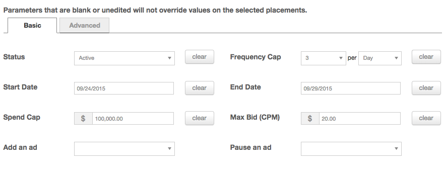
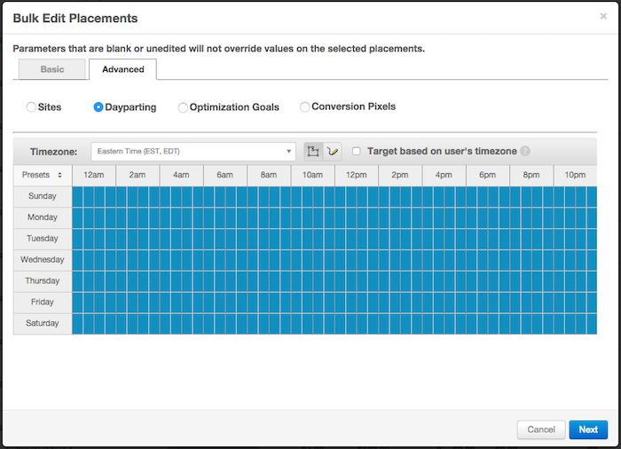

# Bulk Tools {#bulk-tools}

These features will reduce time spent creating and editing placements, making managing campaigns at least 5 times easier. 

#### **Attach Multiple Ads to Placements:** {#attach-multiple-ads-to-placements}

Never attach the same ad one by one to multiple placements, or the same placement assigned one at a time to multiple ads ever again. We’ve now simplified the process so you can easily select multiple ads/placements to attach in bulk, saving you a significant amount of time and energy! Access this feature&nbsp;from the ad or placement section, via the gear on the right hand side.  &nbsp; *&#42;Note, there is a maximum of 20 selections you can do at one time.* &nbsp; 

#### **Bulk Editing** {#bulk-editing}

Reduce the amount of effort and clicks it takes to make changes across different placements. If you scroll down to the bottom of the page, select "Bulk Edit" and choose the placements you'd like to change.  &nbsp; Once prompted, you'll be able to access basic and advanced options to make changes to. Under basic you can modify:

* Status
* Start/End&nbsp;Date
* Spend Cap
* Ad or Pause ads
* Frequency Cap
* Max Bid (CPM)

 The second or Advanced tab allows users to access additional features, such as:

* Sites - ability to add or remove up to 5 sites at a time
* Dayparting
* Optimization Goals
* Conversion Pixels

 Before hitting save, the platform will prompt you to confirm your changes and you're all done! If you have any additional questions, please reach out to your Account Manager or platform_support@tubemogul.com. 