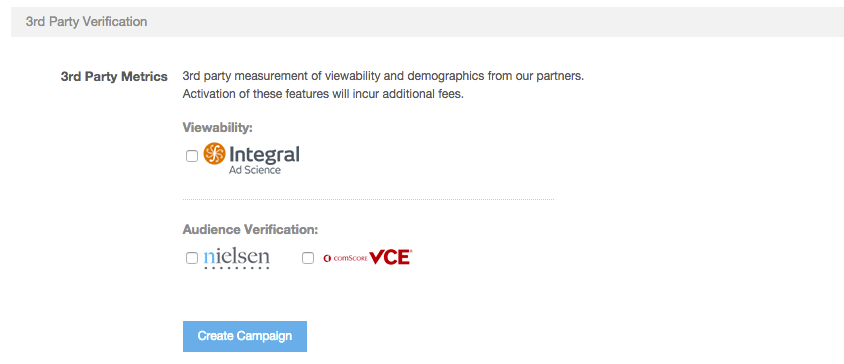

# Campaign Setup {#campaign-setup}

To create a new campaign, navigate to the left hand menu and select Campaigns. Once on this page, you will see a blue "Create New Campaign" button on the right hand side.

* `Name`: Choose a name for your campaign.
* `Advertiser`:&nbsp;Select an advertiser (brand) or create a new one.
* `Advertiser URL`:&nbsp;brand’s official page . This field speeds up your ad approval process on our inventory partner’s end.
* `Timezone`:&nbsp;Select the timezone for reporting and bidding.
* `Customer PO`:&nbsp;This field is optional, but can be used if your IO has a customer purchase order.
* `Frequency Cap`: Allows you to frequency cap at the campaign level. (also optional)

The next section of the page, is Campaign Goals. Fill out the Campaign Spend Cap and decide if you'd like to enter a frequency cap for your campaign.

The last piece of this section is Packages. Packages, is a feature that groups placements together based a common goal for easier management, tracking, and reporting.
``   

&nbsp;
`Feature Set Up`:

Click 'Create a New Package' and it will prompt the following box:

&nbsp;

* `Name`: Choose a name for your package
* `Dates`: Flight dates, note that all placements tied to this package must fall within these dates. These dates must also fall within the campaign flight dates.
* `Description`: Optional, if you'd like an additional description
* `Goal Type`: Select the metric&nbsp;that is your primary goal
* `Delivery Goal`: The number you'd like to deliver
* `Package Type`&#42;: The pricing method you'd like to track against
* `3rd Party Billed Fees`: Enter a consolidated CPM amount and 3rd party fee description.

    * This feature does not override fees for services provided by TubeMogul such as Nielsen, comScore and IAS. &nbsp;To bring your own rate for these services, reach out to your Account Manager. These fees will be tracked as "non-billable other cost". To see a full walkthrough of this feature, [click here](http://fast.wistia.net/embed/iframe/rhi560hsx0?popover=true).

*&#42;Note, the platform will only track these metrics NOT cap delivery.&nbsp;*

Once the packages are created, be sure to associate each placement with the appropriate package. This will ensure that all placements are being tracked correctly.

&nbsp;

Finally, there is 3rd Party Verification.

This section allows you to enable:

* [IAS Viewability](../../user-guide/measurement/viewability/ias-integration.md)
* [Nielsen DAR](../../user-guide/measurement/nielsen-ocr-reporting.md)
* [Comscore VCE](../../user-guide/measurement/comscore-vce.md)

&nbsp;
Once your campaign is created, click on the blue widget next to your campaign name to enable Campaign [Optimization Goals](../../user-guide/optimization/optimization-goals.md). This feature allows users to set optimization goals and priorities in order of importance and automatically adjusts&nbsp;spend to sites where you are delivering the metrics you most care about, ensuring that your dollars are spent efficiently to achieve your goals.

Considerations:

* Campaign Optimization Goals will apply to all placements created **after** campaign goals are set. They will not apply to any placements created **before** campaign goals are set.

* Any Optimization Goals set for a particular placement within the [Placement Editor](placement-setup.md) will override goals set at the campaign for that placement.

&nbsp; 