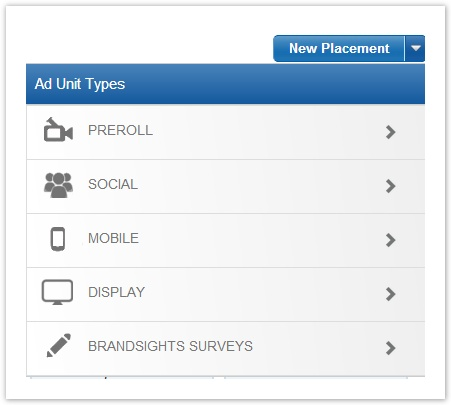
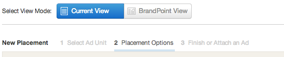
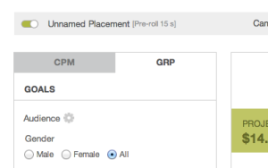

# Placement Setup {#placement-setup}

A placement stores all the targeting parameters for a specific ad unit or set of video ads. You can create unlimited number of placements for each campaign. Typically specific campaign goals or reporting needs will determine how you set up your placements within a campaign.

After you've created a new campaign, click Placements in the left navigation bar. Select your newly created campaign from the drop down.

Click New Placement on the upper right and select the type of ad unit and duration you'll be using. Selecting the correct duration is important for in-stream units as it may determine inventory availability.

Once you've selected the ad format of choice, you will by default land on the [Placement Options page in Current View mode](placement-setup/placement-options.md). Click on the below links to learn how to fill out each section of the Placement Options page:

You can also set up a placement in BrandPoint View:

* [CPM Mode](placement-setup/cpm-setup.md)&nbsp; (New Look and Feel for the same functionality as the Current View)
* [OTP Mode (On-Target %)](placement-setup/otp-setup.md)&nbsp;(Use for Audience Guaranteed On-Target Impression buys)
* [GRP Mode](placement-setup/grp-setup.md)&nbsp;(Mirror your TV Buys. Read more about planning GRP campaigns [here](../user-guide/planning/brandpoint/buying-in-cost-per-point.md))

&nbsp; 