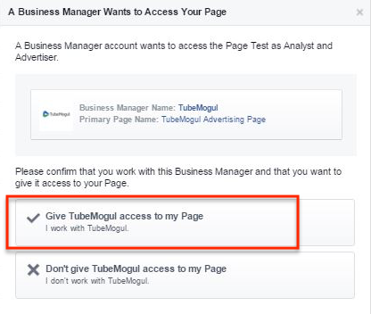
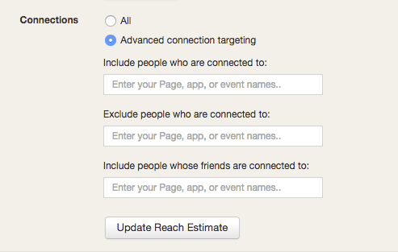

# Facebook Placement Setup {#facebook-placement-setup}

The first step in getting this channel set up in the platform is sharing your Facebook page url with a TubeMogul representative and giving them Advertiser Access to your Facebook page. Access to this page will not allow TubeMogul to post on your page, but utilize your information to advertise on behalf of your brand.&nbsp;Full range of access below:

`How to Approve Advertiser Access`

Click on "Respond to Request":

&nbsp;

Approve the request to give us access to the page:

&nbsp;

Confirm the approval:

&nbsp;

Save the changes and the next module will ask you to re-enter your password. That's it. The setup in the FB Power Editor is complete!

&nbsp;
`TubeMogul Campaign Basics`

* Auction Based Buying is the buying type that can be utilized via this integration
* Video views is the default campaign objective and the platform will automatically optimize between the following ad types:

    * Click to Play - initiates&nbsp;on user click or tap
    * Autoplay - begins playing with sound off when >50% of the ad is in view, pauses if the user scrolls away

* When using this channel, you'll need to manage your margin, frequency and budget cap manually. The platform will only account for the non-Facebook placements.

`Placement Setup`

* Navigate to the "New Placement" button and select "Facebook News Feed"

&nbsp;

* Setup the placement like you would any other TubeMogul placement, enter the:

    * Name
    * Status
    * Tags - optional
    * Flight Dates
    * Geo location
    * Dayparting - if applicable&#42;
    * Device Targeting refers to the mobile portion of the buy. Select Android or iOS if applicable

&#42;Note, that this is only available on placements that will be using an "all time" placement spend cap.

&nbsp;

* The power of Facebook's&nbsp;data is within the "Facebook Specific Targeting". This is where you can choose:

    * The type of placement you'd like within Facebook - Mobile News Feed, Desktop News Feed Desktop Right Column, and/or Instagram
    * Demographic data that ranges from age, gender, relationship, education, and work information

&nbsp;

* Languages
* Advanced Combinations that allow you to target people who match ANY, ALL, or EXCLUDE any&nbsp;of the criteria you've selected
* Search keywords or browse amongst 4 sections: Behaviors, Demographics, Interests, and More Categories

&nbsp;

* The last section in this section are the "Connections" - here you are able to target people or their friends that are connected to a specific page, app, or event. If you're not interested in targeting those individuals, you also have the ability to exclude people that are connected to any page.
* Once you've made all your selections you're able to "Update Reach Estimate" to get a better understanding of your global reach&nbsp;in the top right hand section of the "Facebook Targeting Section"

&nbsp;
The last section of the Placement Editor is the Budget and Bid:

* Placement Spend Cap refers to the maximum amount you'd like to spend, the dropdown allows for a day or all time interval

    * If you're using Dayparting, the only option that is available is all time

* Max Media Bid - here you can select a dollar amount or choose "Don't set max bid" to have the system automatically set the best dollar amount for your goals

    * Video Views - selecting this option will change your buying method to CPV, affecting the number you enter in the "Max Media Bid"
    * Daily Unique Reach - this option is intended for users that would like to buy on a CPM

&nbsp;

&nbsp;

`Reporting`
Reporting is available at the campaign, package, placement, and ad level. The initial metrics that are part of the integration are as follows:

* Impressions
* Views - defined as 3 seconds after the ad has started
* Completions
* Clicks
* Cost
* eCPM/eCPV

Available via Custom Reports:

* Shares, Likes, Comments on Posts
* Likes on Page

If you have any additional questions, please reach out to your Account Manager or platform_support@tubemogul.com. 