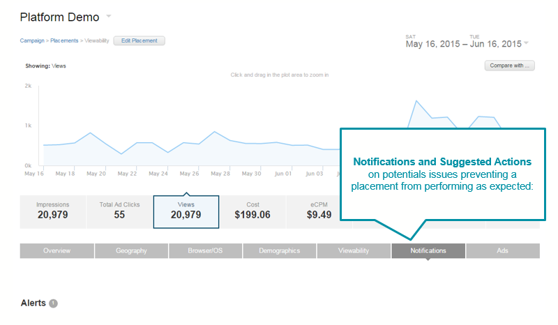
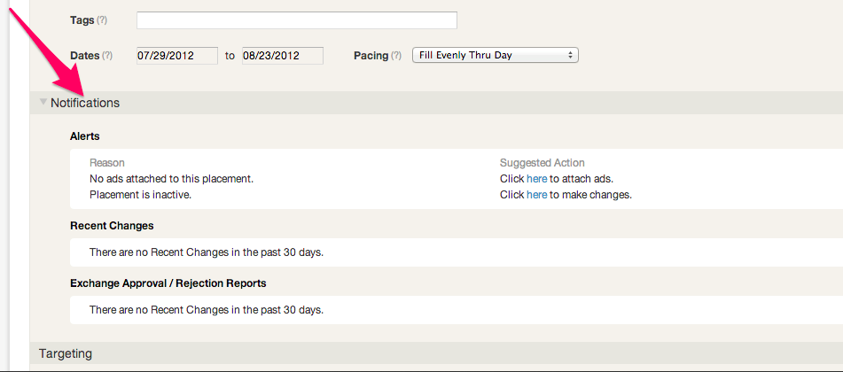

# Notifications {#notifications}

**What is it:**

A diagnostic tool that provides more visibility into placement problems and offers potential solutions. This tool has 3 main features:

&nbsp;

* Alerts and suggested actions.&nbsp;Alerts&nbsp;are categorized red flags or warnings over potential issues that may be blocking/preventing a placement from performing as expected.&nbsp;Note:&nbsp;these are&nbsp;not&nbsp;emailed alerts.

    * RED LEVEL (high)

        * Not enough money in account to support all active placement budgets
        * No ads attached to this placement
        * No active ads for this placement
        * Ad has been admin rejected
        * Placement has a low win rate

    * ORANGE LEVEL (Medium)

        * This placement is active but has surpassed it’s end date
        * Approaching campaign budget cap. You have spent X% of your budget cap
        * Placement is inactive
        * Ad has not been admin approved yet
        * Currently, there are no active ads for placement’s custom flight
        * This placement is ending soon

* Recent changes&nbsp;is as an activity log for account user changes made to the following:

    * Max bid
    * Budget
    * Start Date
    * End date
    * Goals
    * Status
    * Frequency Cap
    * Placement Name

* Exchange approval/rejection&nbsp;will list ad approval/rejection reports from an exchange. (for e.g. if Google AdX rejects an ad)

&nbsp;

**Where to find it:**

There are two places in the UI where the Notifications will be accessible:

1) From placement reports in a tab called Notifications

2) From edit placement page, in a section called Notifications

**Why it is useful:**

Diagnostic tool flag and alerts for potential issues with placements - then suggests remedies.&nbsp;This will enable troubleshooting to be part of your normal workflow of a campaign.

**When to use it:**

As the first step in troubleshooting placement-wide issues.
**What it currently does not do:**

* While the feature can be accessed from any placement report page, it will not be available in the edit placement page for BrandPoint placements
* The first iteration will not track changes for targeting parameters like site lists, geos, audience segments
* Will also not track changes by user

&nbsp;
&nbsp; 