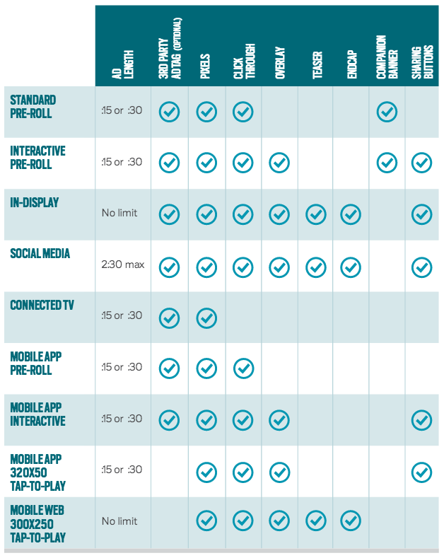

# Ad Features Guide {#ad-features-guide}

TubeMogul's platform offers a suite of features you can layer on when creating your ad formats. Features include:

* [Overlays](../user-guide/execution/ad-unit-setup/overlay/user-guideexecutionad-unit-setupoverlay.md)
* [Companion Banners](../user-guide/execution/ad-unit-setup/3rd-party-tracking-adserving/companion-banner/user-guideexecutionad-unit-setup3rd-party-tracking-adservingcompanion-banner.md)
* [Social Sharing Buttons](../user-guide/execution/ad-unit-setup/sharing-buttons/user-guideexecutionad-unit-setupsharing-buttons.md)
* [Teasers & Endcaps](teasers-endcaps/user-guideplanningad-formatsad-features-guideteasers-endcaps.md)
* [Ad Tags & Tracking Pixels](../user-guide/execution/ad-unit-setup/3rd-party-tracking-adserving/user-guideexecutionad-unit-setup3rd-party-tracking-adserving.md)

**Summary of Ad Unit Features**  