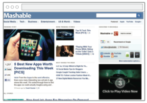

# Click to Play {#click-to-play}

##  {#click-to-play-click-to-play}

**Player Action:**

* Video served in a 300x250 player with a large "Play" button over center of video
* On click, video begins playing with sound on

**Benefits:**

* Delivers engaged viewers who choose to watch your video
* Add branded overlays and sharing buttons to drive user actions and encourage brand association
* Add a video teaser to entice viewers to click on your ad
* Video can be any length (< 2 min recommended)
* Use YouTube player to drive your YouTube view count

**Considerations:**

* Recommended for 10-15% of campaign budget
* Playrates (views/impression): 0.05-0.1%

**Recommended Pricing Model:**

* [CPM](../user-guide/planning/ad-formats/performance-pricing.md)

**Video Specifications:**

* View asset specs&nbsp; [here](../user-guide/planning/ad-formats/ad-specs.md)

