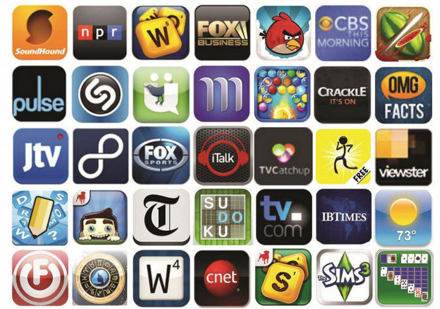

# Mobile {#mobile}

Create, target and launch your mobile ads with the same ease TubeMogul provides your other video ad initiatives.&nbsp;Reach your audience across the major mobile platforms including iPhone, iPad and Android. Deliver your videos within specific games and apps across mobile browsers. Targeting capabilities include IOS, Device, Geo and Day Part targeting. Choose from the following three types of mobile units: [Phone + Tablet Standard Pre-Roll](mobile-app-pr/user-guideplanningad-formatsmobilemobile-app-pr.md), [Phone + Tablet Interactive Pre-Roll](mobile-interactive-pr/user-guideplanningad-formatsmobilemobile-interactive-pr.md), [Phone Tap-to-Play Banner (320x50)](mobile-app-ctp/user-guideplanningad-formatsmobilemobile-app-ctp.md), and [Tablet Tap-to-Play Medium Rectangle (300x250)](mobile-web-ctp/user-guideplanningad-formatsmobilemobile-web-ctp.md).

**Mobile App Units Run on Quality, Safe, App Environments**  