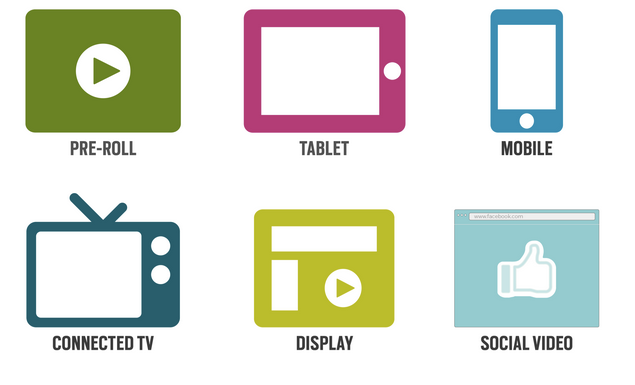

# Ad Formats {#ad-formats}

TubeMogul offers a variety of ad units to help you achieve your campaign goals and reach your audience wherever they are watching video online. Ad formats include&nbsp; [In-Stream](in-stream/user-guideplanningad-formatsin-stream.md),&nbsp; [In-Display](in-display/user-guideplanningad-formatsin-display.md),&nbsp; [Mobile](mobile/user-guideplanningad-formatsmobile.md),&nbsp; [Social](social/user-guideplanningad-formatssocial.md)and&nbsp; [Connected TV](connected-tv/user-guideplanningad-formatsconnected-tv.md).&nbsp;Each ad format has its own strengths depending on brand objectives.TubeMogul offers a solution for brands to choose multiple formats, from a single platform, to maximize reach, optimize performance or effectively target different audiences with different videos. [Click here](http://gallery.tubemogul.com/) to browse through TubeMogul's complete online video gallery.  