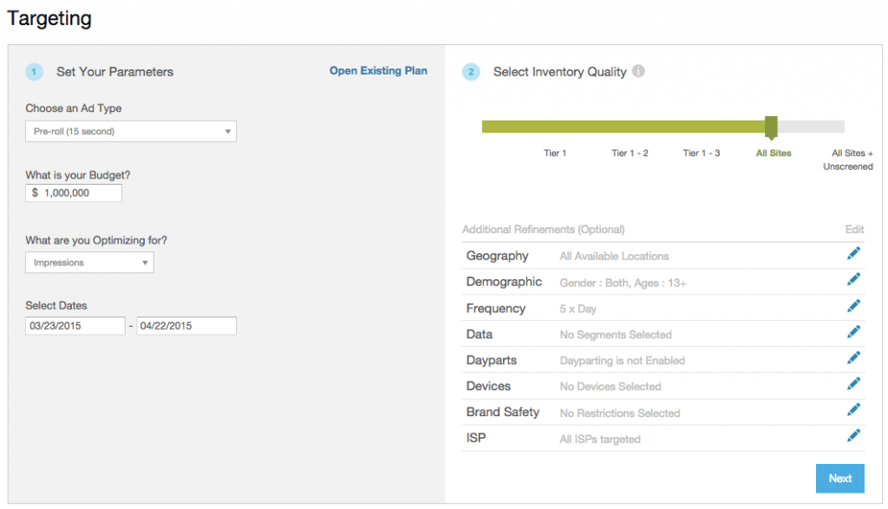
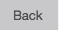
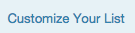
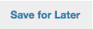
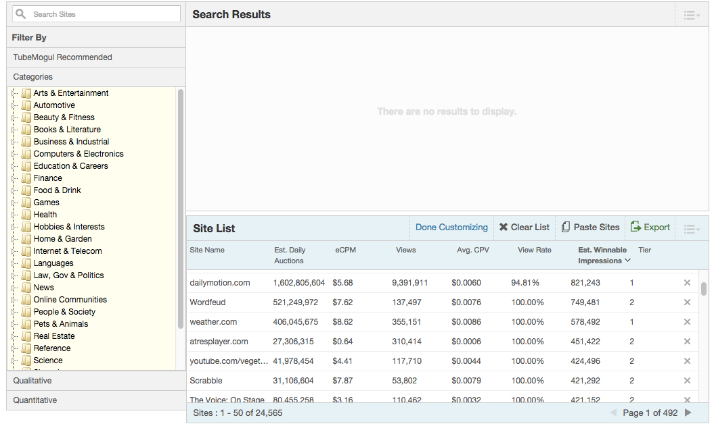
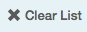
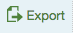

# Planning Tool {#planning-tool}

TubeMogul is excited to announce our recent launch of the new&nbsp;Planning Tool currently in beta. The tool allows you to plan campaigns, verify avails and save your plans for future use. &nbsp;Follow the steps below to try it out. If you have any recommendations or feedback&nbsp;please let your account manager know.
**SETTING YOUR CAMPAIGN OBJECTIVES**

#### ** 

**

#### **Step 1:** {#step}

In this section, you set up the objectives of your plan. Which [ad type](ad-formats.md) are you trying to plan for, what is your allocated budget, which primary metric do you want to [auto-optimize](../user-guide/optimization/optimization-goals.md)for, and what are the flight dates of the plan.
There is also the option to Open Existing Plan. In the planning tool, there’s the ability for you to save a plan to your account. By selecting Open Existing Plan, you can retrieve any previously saved plan and all the targeting parameters from that plan will auto-populate the fields in the planning tool. This is great for re-using plans with similar targeting parameters or even site lists!

#### **Step 2:** {#step-1}

In this section&nbsp;you&nbsp;select [inventory quality](brand-safety/sitesafe-quality.md)and [additional placement parameters](targeting/targeting-options.md)&nbsp;including geo-target, demo-target ( [if planning an audience buy](brandpoint.md)), frequency cap, day-parting, device targeting, & brand safety.

&nbsp;

**PROJECTING INVENTORY AVAILABILITY**

** 

**

**Step&nbsp;3:**

In this section you are able to verify inventory availability for the plan you have proposed.

The page brings some familiar features. You’ll notice the supply chart in the left and you can drag the budget bar to see projections automatically update in the blue&nbsp;Projection Bar underneath the chart. To the right&nbsp;of the supply chart, you are able to adjust your budget, flight dates and Max CPM bid.

&nbsp;

Below the blue projection bar, you'll see &nbsp;the current site list&nbsp;is&nbsp;pre-selected based on the quick inventory tier selection from the previous page. From here, if you'd like to further&nbsp;customize your site list, click on the&nbsp;"Customize Your List" &nbsp;button to access a myriad of other filters.
From here, you can do a myriad of things:

* Click on &nbsp; &nbsp;if you'd like to go back to Step 1 & 2 and change your targeting parameters.

* Click on &nbsp;to add/remove more site metrics. These performance metrics are based on historically collected data for sites within TubeMogul’s platform.

* Click on &nbsp;to download your sitelist verticalized by categories

* Click on &nbsp;to&nbsp;adjust your site list

* Click on &nbsp; to save your plan in progress or complete your plan

* Click on &nbsp; &nbsp;if you are satisfied with your plan and would like to run it in a placement immediately

**Step 4 - Customize Your Site List (Optional)&nbsp;**

For those of you who are new to the platform, please take notice of two important sections in this view:

* *Search Results*
* *Site List*

*Search Results* will display all the sites associated with the filters that you select. If you want to add sites from the *Search Results*to your site list, just click on the checkbox to the left of the site.
If you want to remove sites from the site list, there are two ways to do that:

* Click on the ‘x’ to the right of the site removes that site from your site list

* Click on &nbsp; &nbsp;to remove&nbsp;your entire list and start from scratch or click on &nbsp; &nbsp;to&nbsp;paste in&nbsp;a white list

Once you are&nbsp;done customizing your site list, click &nbsp; &nbsp;. You may also &nbsp;your site list to excel.

**Final Step&nbsp;**
Lastly, remember that your final step is to go back up the right side of the page and either &nbsp;or &nbsp; .

####

