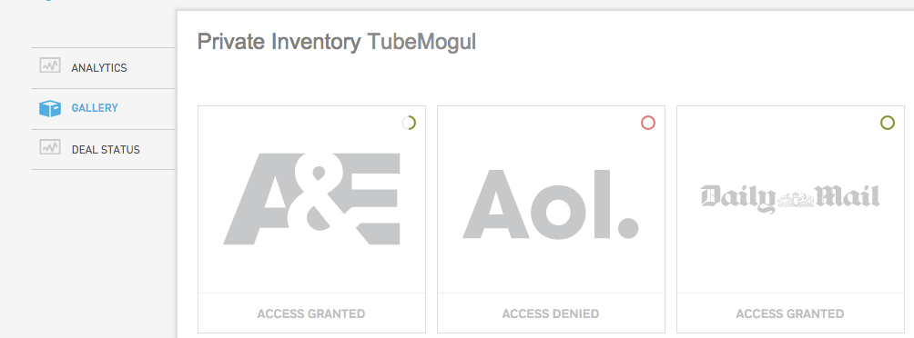

# On Demand Inventory {#on-demand-inventory}

The On Demand option allows advertisers to instantly access premium, non-guaranteed inventory at your point of need without one-on-one negotiations. On Demand offers advertisers the quickest access to new inventory with risk-free exploration directly within the TubeMogul platform. `Feature Set Up:`

* Step 1: Navigate to the Premium Inventory section of our platform, using the top menu bar. Once in the Select Access gallery, choose the publisher you're interested in working with.

* Step 2: If you'd like information on the deal, hover&nbsp;on the publisher and choose "On Demand Deals".

* Step 3: See information about all the feeds that are available.

* If you have gotten full approval on all the feeds than the front page of the tablet will have a green full circle, if you've gotten approval for 1 or more than you'll get a half green circle. If your request has been denied, you'll get a red circle.

* `<li>&nbsp;If you have any questions about the approval process, please reach out to your Account Manager or platform_support@tubemogul.com. If you are approved,&nbsp;placement set up is as follows:</li>`

``

Walkthrough of this process:

* To begin bidding on this inventory, you'll have to create a placement and specifically target the feed. Under the Inventory Sources section of the placement editor, you will see the option to "Customize Private Inventory".

 &nbsp;

* Target the feed that you'd like to gain access to. In this example it is A&E for desktop:

 &nbsp;

* Once you've done that and set your bid appropriately, your placement is all set!

If you have any additional questions, please reach out to your Account Manager or platform_support@tubemogul.com. &nbsp; 