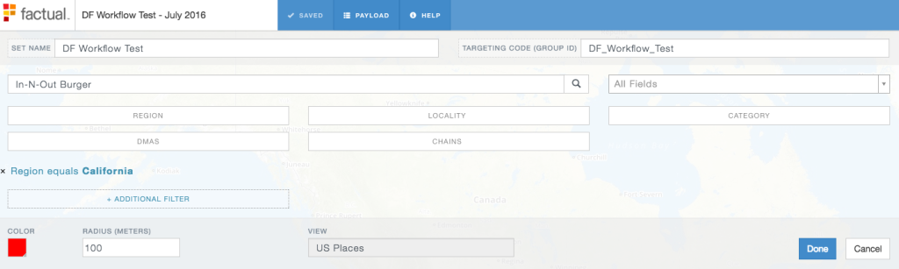
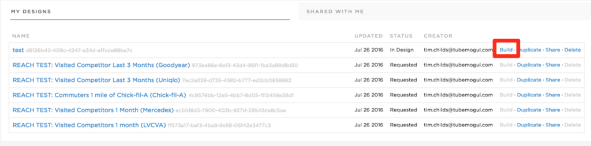
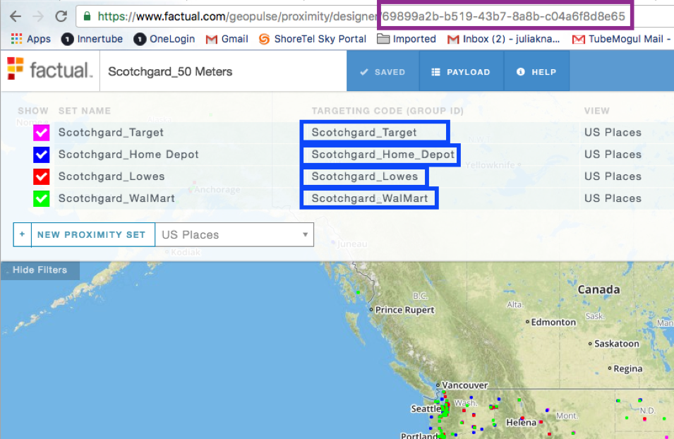
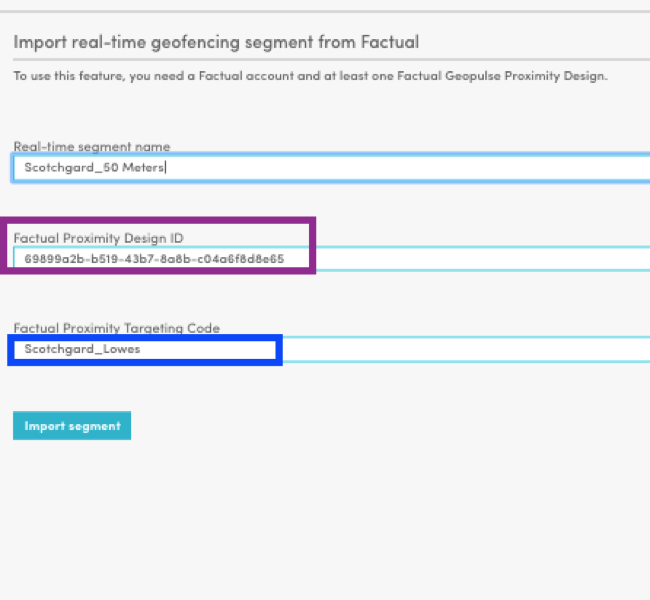
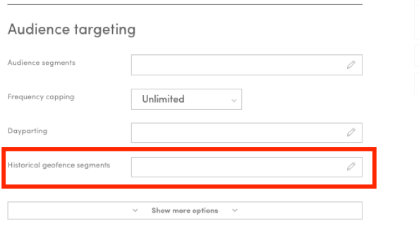

# Location-Based Mobile Targeting {#location-based-mobile-targeting}

TubeMogul's integration with Factual allows advertisers to leverage two types of location based targeting:

1. Geofencing (Proximity campaigns) - select a point of interest (address, store name, etc.) and target mobile users who are within a specific radius (meters)

    * Example: Target mobile users who are 100 meters away from all In-N-Out Burger locations in California

1. Historical Location-Based Targeting (Audience Segments) - select predefined audience segments by brand affinity, behavior, geo, demo, etc., or build customized segments using historical visitation patterns.

    * Predefined segments ex. - mobile users who have visited stores like Anthropologie, Cole Haan, or H&M within the last month
    * Customized segments ex. - define a point of interest and target users who have visited that location in the past 3 months

Users will need to create geofencing and historical audience segment designs in Factual's UI, then import the design information in TubeMogul's platform. Refer to steps below.

&nbsp;

`**How to Create Designs in Factual's UI**`

**Real-Time Geofencing (Proximity Targeting)**
1. Log onto Factual's platform - reach out to your Account Manager if you do not have an account - then create a new design.

* Click new proximity design -> enter Design Name, Set Name and Targeting Code Group ID
* Make sure to set clear and descriptive naming conventions to make searching for designs easier.&nbsp;Examples:

    * Design Name: TubeMogul Design
    * Set Name: Within 500M of TubeMogul
    * Targeting Code Group ID: TubeMogul_500M

* Search for business location, enter address or use filters to narrow down the list

    * Note: locations displaying on the right side are not selectable yet - Factual is working on&nbsp;the ability to add/delete locations

* Enter radius for geofence

    * The smaller the geofence is the smaller you'll scale will be

**Historical Geofence Segments&nbsp;(Audience Targeting)**

* Start a new audience design -> enter Design Name and Targeting Code Group ID
* Select Nexage/Millennial, MoPub, Aerserv and Co-Op as the data provider

* You can choose pre-built segments and apply boolean logic using "and" / "or" statements, but scale might be limited if you use the "and" logic
* Save Design

* Tailored segments are based on Proximity Designs you've created, so be sure to create those first

    * Select Proximity Design

        * Choose lookback window: 1 month, 3 months, 6 months, or 1 year

    * Save Design

&nbsp;
**Apply the remaining steps below for both Real-Time and Historical Geofence Targeting:**

* Make sure to click build to save and target the design

* Select TubeMogul and click save

Note: It will take 1-3 days for the build to finish. Factual will process the request and notify you via email when your Build is live.

&nbsp;

**`Set Up in TubeMogul's Platform`**

**Real-Time Geofencing (Proximity Targeting)**
1.&nbsp;

**`Factual targeting information should be inputted in the NEW placement editor in the area below:`**

&nbsp;

2.&nbsp;

**`Once this area is selected, you will need to import the Factual targeting information.`**

**`3. Targeting information can be found in the below area on the Factual dashboard under the “Proximity” section on the far left and “My Designs.” Once you find your desired design, click on the title.`**

&nbsp;
4.  **`Copy the information in thePURPLE&BLUE``boxes below in`**screenshot C**`and input in the corresponding area under import in Tubemogul's platform (see`** **`.`**

Screenshot C

&nbsp;

Screenshot D

&nbsp;
`Some additional aspects to consider below:`

* `The “real-time segment name” is not assigned. You can choose the naming convention but best to keep it consistent with the “Design Name” in the Factual UI.`
* `As you can see in`**Screenshot C**, `you can have multiple targeting codes for each Design ID. Each targeting code needs to be imported separately.`

* `If provided directly from the Factual team they should specify the “Factual Proximity Design ID” and “Factual Proximity Targeting Code”.`

**`5. Once you have imported all designs you would like to target, check the ones you would like to utilize for the placement as seen below.`**

Screenshot E

`As you can see in` **screenshot C** `, there were four different “targeting codes” for the one “design ID” so four designs were imported and selected. You do not have to include all targeting codes on a placement. You can select as many or as few you have imported.`

**`After importing a segment on a placement, it will be available to utilize for any mobile placement on the campaign. You will be able to see all segments selected on the “select” page above on the right.`**

&nbsp;

**Historical Geofence Segments (Audience Targeting)**

**`1. Audience targeting information should be inputted in the NEW placement editor in the area below:`**

2. Once this area is selected you will need to import the Factual targeting information.

**`3. Targeting information can be found in the below area on the Factual dashboard under the “Audience” section on the far left and “My Designs”.`**

**`4. Copy the information in the``GREEN``&``YELLOW``boxes above in`**screenshot B**`and input in the corresponding area under “import” in the Tube UI in`**screenshot C****

Screenshot C

&nbsp;

**`If provided directly from the Factual team they should specify the “Historical segment name” and “Factual geopulse Audience Design ID”.`**

**`6. Once you have imported segments for each data provider available for the ad format (Aerserv, AOL Nexage, Co-Op & Mopub), check the ones you would like to utilize for the placement as seen below in`**screenshot D.****

Screenshot D

**`Similar to Proximity targets, after importing a segment on a placement it will be available to utilize for any mobile placement on the campaign.`**

&nbsp;
`**Best Practices**`

* `Build Factual design(s) 72 hours before campaign placement is set to go live`
* `Do not combine Factual targeting with traditional audience segments (e.g.BlueKai etc) as this is will reduce scale significantly`
* `Check the impression / device estimates in the Factual platform`

    * **Note:** `estimates are based on`**ALL** `available auctions for`**ALL** `ad types`
    
    * `5% of this estimate is a more accurate estimate of the scale on TubeMogul`

* `If you are receiving an ERROR message when importing a segment confirm you have checked the below`

    * `The design is confirmed as BUILT in the Factual UI or by the Factual team`
    * `There are no spaces in the segment name. Spaces will not be recognized and seen as an error`

**Audience&nbsp;**

**Proximity (Geofencing)**

&nbsp;

`**FAQs**`
Can you make changes to your design mid-flight?

* Yes, you can edit your Design in the Factual platform. Once you're finished making the changes, click Save and Build. It will take up to 1-3 days before the changes apply.

How small can you set your geofence to?

* To prevent limiting scale, it is best to set the geofence to ~100 meters or larger for urban areas and ~500 meters or&nbsp;larger for suburban areas.

Is traffic coming from mobile web and in-app?

* Audience targeting only works on mobile app as we need to collect device IDs; IDs are only available on apps. Geofencing works on both mobile app and web as only lat/long info is needed.

Can we apply Geofencing and Audience Segments Targeting on private inventory?

* No

If you have any additional questions, please reach out to your Account Manager or platform_support@tubemogul.com.
&nbsp; 